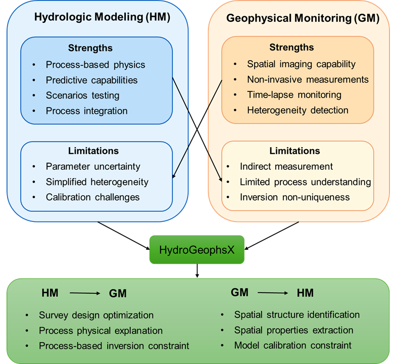

[](https://github.com/geohang/PyHydroGeophysX/actions/workflows/tests.yml)
[](https://opensource.org/licenses/Apache-2.0)
[](https://www.python.org/downloads/)
[](https://doi.org/10.5281/zenodo.17025139)

<div align="center">
  
</div>

# PyHydroGeophysX

A Python package for integrating hydrological model outputs (MODFLOW, ParFlow) with geophysical forward modeling and inversion — ERT, SRT, TDEM, FDEM — for watershed monitoring and critical zone science. Includes a multi-agent AI system for automated geophysical workflows.

<div align="center">
  
</div>

**Links:** [Documentation](https://geohang.github.io/PyHydroGeophysX/) · [Examples gallery](https://geohang.github.io/PyHydroGeophysX/auto_examples/index.html) · [Live demo app](https://pyhydrogeophysx.streamlit.app/) · [Issues](https://github.com/geohang/PyHydroGeophysX/issues)

---

## Features

- **Hydrological model integration** — load MODFLOW and ParFlow outputs
- **ERT data processing** — field data QC, export, and RESIPY integration
- **Forward modeling** — 2D/3D ERT, SRT, TDEM, FDEM synthetic data generation
- **Inversion** — single-time, time-lapse, windowed, structure-constrained, joint ERT+SRT, TDEM, FDEM
- **Petrophysics** — water content ↔ resistivity (Waxman-Smits/Archie), seismic velocity (Hertz-Mindlin, DEM)
- **Uncertainty quantification** — Monte Carlo for petrophysical parameter uncertainty
- **Multi-agent AI system** — automated workflows via GPT, Gemini, or Claude APIs
- **GPU acceleration** — optional CuPy/CUDA support for large-scale inversions

---

## Installation

### Recommended (conda — handles binary deps for PyGIMLi)

```bash
conda env create -f environment.yml
conda activate pyhydrogeophysx
```

### From PyPI

```bash
# Core only (petrophysics, model I/O, solvers)
pip install pyhydrogeophysx

# With geophysics engines (ERT/SRT/TDEM/FDEM inversion and forward modeling)
pip install "pyhydrogeophysx[geophysics]"

# With the optional ADTLERT differentiable 2.5D ERT backend (Python 3.11+)
pip install "pyhydrogeophysx[adtlert]"

# With AI agent support
pip install "pyhydrogeophysx[geophysics,agents]"

# With web app
pip install "pyhydrogeophysx[geophysics,webapp]"

# Everything
pip install "pyhydrogeophysx[all]"
```

> **Note on PyGIMLi:** PyGIMLi links against C++ libraries. If `pip install` fails, install it first via conda:
> ```bash
> conda install -c gimli pygimli
> pip install "pyhydrogeophysx[agents]"  # then add other extras
> ```

The ADTLERT backend plugs into the existing single-time ERT pipeline without
changing its default engine:

```python
from PyHydroGeophysX.inversion.ert_inversion import run_ert_manager_inversion

result = run_ert_manager_inversion(
    "survey.dat",
    "output",
    engine="adtlert",
)
```

On Linux, the `adtlert` extra installs the GPU-enabled PyPI Torch distribution
and ADTLERT's CUDA 12 CuPy/cuDSS solver stack. When that complete CUDA stack is
unavailable, selecting ADTLERT automatically uses the original PyHydro ERT
engine instead.

ADTLERT can also run the windowed time-lapse workflow on one shared GPU forward
operator and cuDSS context:

```python
from PyHydroGeophysX.inversion.time_lapse import run_timelapse_ert

result = run_timelapse_ert(
    ["survey_0.dat", "survey_1.dat", "survey_2.dat"],
    [0.0, 1.0, 2.0],
    {"engine": "adtlert", "windowed": True, "window_size": 3},
    "output",
)
```

All timesteps must use the same electrode positions and ABMN ordering. ADTLERT
processes overlapping windows sequentially on the GPU so solver state and
Jacobian caches are reused without duplicating GPU memory across processes.
The default `cgls` method selects CuPy CGLS on the CUDA-backed ADTLERT path.

Do not combine that CUDA 12 extra with `pyhydrogeophysx[gpu]`, which currently
installs the mutually exclusive `cupy-cuda11x` build.

### From Source

```bash
git clone https://github.com/geohang/PyHydroGeophysX.git
cd PyHydroGeophysX
pip install -e ".[geophysics]"
```

### With a coding agent (Claude Code, Codex)

The install has one decision that trips people up: whether to reach for pip or
conda. Both are correct in different environments, and picking the wrong one
leaves two builds of VTK or Qt on the path. If you already use Claude Code or
Codex, paste the block below and let it check your machine first.

```text
Install PyHydroGeophysX from this repository into my current Python environment.

First run `conda list numpy` and tell me the result. If the channel column says
`pypi`, use pip for everything. If it names a conda channel such as conda-forge,
use conda for the binary packages. Do not mix the two: an environment created by
conda can still be pip-managed, so go by that check rather than by how the
environment was created.

Install these groups: geophysics (pygimli, simpeg), desktop (the Qt workbench),
and desktop-3d (pyvista, pyvistaqt, vtk). PyGIMLi links against C++ libraries
and often needs `conda install -c gimli pygimli` when pip cannot build it.

Show me a dry run and what would change before you modify my environment. Do not
accept any channel Terms of Service for me; if a package manager asks, stop and
tell me the exact command I need to run myself.

Verify when done:
  python -c "import PyHydroGeophysX, pygimli, PySide6, pyvista; print('ok')"
  python -m PyHydroGeophysX.qt_apps.launcher --self-test
```

### Optional extras

| Extra | Packages installed |
|---|---|
| `geophysics` | pygimli, simpeg, pymatsolver, flopy, pftools |
| `adtlert` | adtlert, pygimli, GPU-enabled Torch and CUDA 12/cuDSS on Linux (Python 3.11+) |
| `desktop` | PySide6, pyqtgraph, qtawesome, numpy, pandas |
| `desktop-3d` | pyvista, pyvistaqt, vtk (the Mesh 3D and volume viewers) |
| `agents` | openai, google-generativeai, anthropic |
| `climate` | pydaymet, pandas, xarray |
| `webapp` | streamlit, plotly, streamlit-plotly-events, pyarrow |
| `seismic-raw` | obspy |
| `gpu` | cupy-cuda11x |
| `docs` | sphinx, sphinx-gallery, sphinx_rtd_theme |
| `dev` | pytest, pytest-cov, black, flake8 |
| `all` | all general-purpose groups above; ADTLERT remains opt-in |

`desktop-3d` is separate because `vtk` is a large binary wheel. Without it the
workbench runs and exports meshes as usual, and the 3D panels show an install
message instead of a viewer.

---

## Running the apps

**Web app (Streamlit):**

```bash
streamlit run examples/app_geophysics_workflow.py
```

On Windows, users who downloaded the source package can instead double-click
`examples\start_webapp.bat`. The launcher finds a compatible Python or conda
environment, opens the browser automatically, and installs the web-app
dependencies into a local `.venv-webapp` environment when needed.

Or hand the whole thing to Claude Code or Codex:

```text
Set up and run the PyHydroGeophysX Streamlit app from this repository at
http://localhost:8501.

Check `conda list numpy` first: `pypi` in the channel column means install with
pip, a conda channel means install with conda. Install the `webapp` extra, and
`geophysics` as well if pygimli is missing. Show me a dry run before you change
my environment.

Then run:
  streamlit run examples/app_geophysics_workflow.py

Leave it running, tell me the URL, and report any error from the first page load
rather than only that the server started. If port 8501 is busy, use the next
free port and tell me which one.
```

**Desktop workbench (Qt):**

```bash
python -m PyHydroGeophysX.qt_apps.launcher
# or, after (re)installing the package:
pyhydrogeophysx-workbench
```

On Windows, `examples\start_workbench.bat` opens the workbench from a
double-click, the desktop counterpart of `start_webapp.bat`: no activated
environment and no `PATH` entry needed, and it creates a local
`.venv-workbench` with the desktop dependencies when it finds none.
`examples/start_workbench.sh` is the macOS and Linux version.

Desktop dependencies come from the `desktop` extra (`pip install "pyhydrogeophysx[desktop]"`) or `requirements-desktop.txt`, plus `desktop-3d` for the 3D viewers. Prebuilt Windows/macOS bundles (light and full variants) are on [GitHub Releases](https://github.com/geohang/PyHydroGeophysX/releases/latest); the usage guide is at [Desktop Workbench documentation](https://geohang.github.io/PyHydroGeophysX/agents/desktop_workbench.html).

---

## Package Structure

```
PyHydroGeophysX/
├── core/               # Interpolation, 2D/3D mesh utilities
├── agents/             # Multi-agent AI orchestration
├── data_processing/    # ERT field data loading, QC, export
├── model_output/       # MODFLOW and ParFlow interfaces
├── petrophysics/       # Resistivity and velocity rock-physics models
├── forward/            # ERT, SRT, TDEM, FDEM forward modeling
├── inversion/          # ERT, SRT, TDEM, FDEM, joint, time-lapse inversion
├── solvers/            # CGLS, LSQR, RRLS linear solvers (optional GPU)
├── Hydro_modular/      # Hydro-to-geophysics conversion utilities
└── Geophy_modular/     # Geophysical data processing tools
```

---

## Examples

All examples have paired `.ipynb` notebooks and `.py` scripts under `examples/`. Data is in `examples/data/`, outputs go to `examples/results/`.

| Example | Description |
|---|---|
| `Ex_ERT_data_process` | Field ERT loading, QC, RESIPY export |
| `Ex_model_output` | MODFLOW/ParFlow output loading |
| `Ex_ERT_workflow` | End-to-end ERT forward + inversion |
| `Ex_Time_lapse_measurement` | Synthetic time-lapse ERT schedules |
| `Ex_TL_inversion` | Time-lapse ERT inversion |
| `Ex_Structure_resinv` | Structure-constrained resistivity inversion |
| `Ex_structure_TLresinv` | Structure-constrained time-lapse inversion |
| `EX_SRT_forward` | SRT forward modeling |
| `Ex_SRT_inv` | SRT inversion (PyGIMLi + packaged `SRTInversion`) |
| `Ex_joint_inversion` | Joint ERT+SRT inversion |
| `Ex_cross_constraints` | Cross-gradient / structural constraints |
| `Ex_3D_ERT_forward` | 3D ERT forward with MODFLOW integration |
| `Ex_TDEM_workflow` | TDEM forward + inversion (SimPEG) |
| `Ex_FDEM_workflow` | FDEM forward + inversion (SimPEG) |
| `Ex_hydro_to_multigeophys` | Hydro → petrophysics → multi-method forward |
| `Ex_MC_Hydro` | Monte Carlo uncertainty quantification |
| `Ex_multi_agent_workflow` | Automated multi-agent ERT+seismic workflow |

---

## Contributing

See [CONTRIBUTING.md](CONTRIBUTING.md). Standard fork → feature branch → PR workflow.

---

## Citation

If you use PyHydroGeophysX, please cite:

```bibtex
@article{chen2026pyhydrogeophysx,
  author  = {Chen, Hang and Niu, Qifei and Wu, Yuxin},
  title   = {PyHydroGeophysX: An Extensible Open-Source Platform for Integrating
             Hydrological Models with Geophysical Measurements},
  journal = {SoftwareX},
  year    = {2026},
  note    = {In press},
  url     = {https://github.com/geohang/PyHydroGeophysX}
}
```

```bibtex
@article{chen2026agentworkflow,
  author  = {Chen, Hang},
  title   = {A Generalizable Automated Geophysical Agent Workflow for
             Accessible Subsurface Hydrology Analysis},
  journal = {Big Data and Earth System},
  pages   = {100042},
  year    = {2026}
}
```

Please also cite the underlying libraries you use:

**ERT data processing (ResIPy):**
```bibtex
@article{blanchy2020resipy,
  title   = {ResIPy, an intuitive open source software for complex geoelectrical inversion/modeling},
  author  = {Blanchy, Guillaume and Saneiyan, Sina and Boyd, Jimmy and McLachlan, Paul and Binley, Andrew},
  journal = {Computers \& Geosciences},
  volume  = {137},
  pages   = {104423},
  year    = {2020},
  doi     = {10.1016/j.cageo.2020.104423}
}
```

**Geophysical modeling (PyGIMLi):**
```bibtex
@article{rucker2017pygimli,
  title   = {pyGIMLi: An open-source library for modelling and inversion in geophysics},
  author  = {R{\"u}cker, Carsten and G{\"u}nther, Thomas and Wagner, Florian M},
  journal = {Computers \& Geosciences},
  volume  = {109},
  pages   = {106--123},
  year    = {2017},
  doi     = {10.1016/j.cageo.2017.07.011}
}
```

**EM modeling (SimPEG):**
```bibtex
@article{cockett2015simpeg,
  title   = {SimPEG: An open source framework for simulation and gradient based parameter estimation in geophysical applications},
  author  = {Cockett, Rowan and Kang, Seogi and Heagy, Lindsey J and Pidlisecky, Adam and Oldenburg, Douglas W},
  journal = {Computers \& Geosciences},
  volume  = {85},
  pages   = {142--154},
  year    = {2015},
  doi     = {10.1016/j.cageo.2015.09.015}
}
```

**Hydrological modeling (FloPy / MODFLOW):**
```bibtex
@article{bakker2016flopy,
  title   = {Scripting MODFLOW Model Development Using Python and FloPy},
  author  = {Bakker, Mark and Post, Vincent and Langevin, Christian D and Hughes, Joseph D and White, Jeremy T and Starn, J Jeffrey and Fienen, Michael N},
  journal = {Groundwater},
  volume  = {54},
  number  = {5},
  pages   = {733--739},
  year    = {2016},
  doi     = {10.1111/gwat.12413}
}
```

**Related geophysics-hydrology study:**

- Chen, H., Niu, Q., Mendieta, A., Bradford, J., & McNamara, J. (2023). Geophysics-informed hydrologic modeling of a mountain headwater catchment for studying hydrological partitioning in the critical zone. *Water Resources Research, 59*(12), e2023WR035280. https://doi.org/10.1029/2023WR035280
