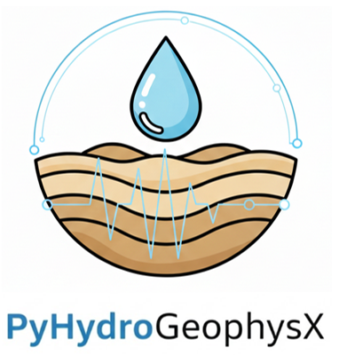
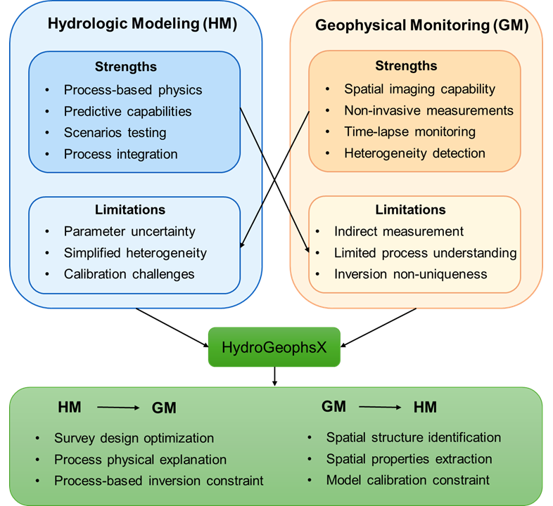

[](https://github.com/geohang/PyHydroGeophysX/actions/workflows/tests.yml)
[](https://opensource.org/licenses/Apache-2.0)
[](https://www.python.org/downloads/)
[](https://doi.org/10.5281/zenodo.17025139)

<div align="center">
  
</div>

# PyHydroGeophysX

A Python package for integrating hydrological model outputs (MODFLOW, ParFlow) with geophysical forward modeling and inversion — ERT, SRT, TDEM, FDEM, MT — for watershed monitoring and critical zone science. Includes a multi-agent AI system for automated geophysical workflows.

<div align="center">
  
</div>

**Links:** [Documentation](https://geohang.github.io/PyHydroGeophysX/) · [Examples gallery](https://geohang.github.io/PyHydroGeophysX/auto_examples/index.html) · [Live demo app](https://pyhydrogeophysx.streamlit.app/) · [Issues](https://github.com/geohang/PyHydroGeophysX/issues)

---

## Features

- **Hydrological model integration** — load MODFLOW, ParFlow, ATS and PFLOTRAN outputs
- **Forward modeling** — 2D/3D ERT, SRT, TDEM, FDEM synthetic data, with E4D-style 3D ERT meshes
- **Inversion** — single-time, time-lapse, windowed, structure-constrained, joint ERT+SRT, TDEM, FDEM
- **ERT engines** — the built-in engine, the optional GPU engine ADTLERT ([Yang et al. 2026](https://arxiv.org/abs/2608.14661)), and the external E4D, R2 and R3t ([where they run](https://geohang.github.io/PyHydroGeophysX/methods/ert.html#ert-e4d)); a-priori resistivity zones work with every engine
- **ERT data processing** — field data QC, reciprocal errors, temperature correction, export, and ResIPy integration
- **Magnetotellurics (MT/AMT)** — time-series processing, Occam 1D with TEM static-shift correction, 2D inversion on SimPEG
- **Petrophysics and uncertainty** — water content ↔ resistivity (Waxman-Smits/Archie) and seismic velocity (Hertz-Mindlin, DEM); Monte Carlo uncertainty
- **Multi-agent AI system** — automated workflows via GPT, Gemini, or Claude APIs
- **GPU acceleration** — optional CuPy/CUDA support for large-scale inversions

---

## Installation

### Recommended — conda

conda handles PyGIMLi's binary dependencies:

```bash
conda env create -f environment.yml
conda activate pyhydrogeophysx
```

### From PyPI

```bash
pip install pyhydrogeophysx                  # core: petrophysics, model I/O, solvers
pip install "pyhydrogeophysx[geophysics]"    # + ERT/SRT/TDEM/FDEM forward modeling and inversion
pip install "pyhydrogeophysx[all]"           # every general-purpose extra (ADTLERT stays opt-in)
```

If `pip` fails on PyGIMLi, install it first with `conda install -c gimli pygimli`, then add the extras.

### From source

The example scripts, notebooks, their data in `examples/data/` and the Streamlit apps come only with the repository, not the pip package:

```bash
git clone https://github.com/geohang/PyHydroGeophysX.git
cd PyHydroGeophysX
pip install -e ".[geophysics]"
```

### With a coding agent (Claude Code, Codex)

The install has two decisions that trip people up: whether to reach for pip or
conda, and whether this machine can use the CUDA build. Both pip and conda are
correct in different environments, and picking the wrong one leaves two builds of
VTK or Qt on the path. The GPU question is worse, because a CPU-only Torch wheel
installs without complaint and the CUDA engine then quietly falls back.

Paste the block below into Claude Code or Codex. It checks the machine, installs
the matching build, and runs a small example before reporting success.

```text
Help me install PyHydroGeophysX and verify it on this computer.
Repository: https://github.com/geohang/PyHydroGeophysX
Official instructions: https://geohang.github.io/PyHydroGeophysX/installation.html
Desktop guide: https://geohang.github.io/PyHydroGeophysX/agents/desktop_studio.html

1. Inspect my OS, Python executable/version, available environment managers,
   and existing NumPy, Qt, VTK and geophysical packages. Ask whether I want
   Desktop Studio, Python workflows, or both, and which methods I need.
   Do not assume Conda exists or infer all package origins from NumPy alone.

2. Read the current official installation instructions and package metadata.
   Prefer a dedicated environment with a supported Python version. If I ask
   to reuse an environment, inspect its binary dependencies first. Use its
   existing package manager for those dependencies; avoid duplicate pip/Conda
   Qt and VTK installations. Show the plan before changing the environment.

3. Choose a released package or source checkout explicitly. For a release,
   use python -m pip install with the appropriate extras from the official
   instructions. For source, locate an existing checkout or download the
   official repository into a new directory, then enter the directory that
   contains pyproject.toml before using an editable install. Do not overwrite
   an existing checkout. Every pip command must use the chosen interpreter.
   For updates, locate the checkout currently imported by that interpreter;
   do not create another clone or worktree unless I request it. Record:
     python -c "import sys, PyHydroGeophysX; print(sys.executable); print(PyHydroGeophysX.__file__)"
   An editable source folder and an environment's Scripts launcher are normally
   in different locations; that alone does not indicate a broken installation.

4. Start with the CPU setup unless GPU acceleration is needed and supported.
   For CUDA, inspect the NVIDIA GPU, driver, OS, Python and dependency support.
   nvidia-smi reports driver capability, not the installed CUDA toolkit.
   Select a compatible PyTorch/CuPy/cuDSS combination using current official
   instructions; do not assume any CUDA 12 driver supports every CUDA wheel.
   Never install competing CuPy variants. If torch.cuda.is_available() is
   False, inspect the wheel, driver and device availability before diagnosing
   the cause. Report an unsupported GPU configuration and offer the CPU path.

5. Verify imports, the installed version and required engines. Download only
   the small example files needed for a check, using a downloader suitable
   for this OS, into a new test directory. Run a short example and report
   finite results, any warnings and the engine that actually executed.
   If testing ADTLERT, use a compatible dataset without remote electrodes;
   report a fallback rather than claiming that GPU execution succeeded.
   For ADTLERT, also run the three isolated checks (runtime, single, time-lapse):
     python -m PyHydroGeophysX.inversion.adtlert_diagnostics --report gpu-check.json
   Wait for the command to finish and inspect every stage's exit code and JSON
   result. CUDA availability, a passing single-survey test, or Studio self-test
   alone does not verify GPU time-lapse. A traceback line alone does not prove
   that a process crashed; preserve the complete log and final exit status.
   If this command is unavailable in an older release, report time-lapse as
   unverified and use the matching release's documented test, or offer an update.
   On failure, retain gpu-check.json and report each capability separately.
   OpenMP conflicts can affect Intel or AMD CPUs. Do not set KMP_DUPLICATE_LIB_OK,
   delete/rename DLLs, disable line search, or patch NumPy to make a check pass.
   Do not modify source algorithms as part of installation unless I explicitly
   request a code fix. Offer the CPU engine and verify it independently;
   do not reinstall the same package combination repeatedly.
   After successful verification, save python -m pip freeze and, for Conda,
   conda env export. These record this tested machine; they are not a universal
   GPU compatibility guarantee. Re-run the checks after dependency updates.

6. For Desktop Studio, install the desktop extras and the engines needed for
   my methods, then run:
     python -m PyHydroGeophysX.qt_apps.launcher --self-test
   Launch the application and give me the exact command to reopen it.
   Report the environment name, installation path and any unverified features.

   For AQUAH Auto to report, keep provider/model/API key settings in the right
   assistant panel. The OpenAI default is gpt-5.6-luna with medium reasoning.
   Folder classification sends filenames and short previews to that provider;
   report whether a real API call was verified or only offline tests passed.
   RAG uses local reference text. If I request MCP integration, install the
   optional mcp extra and test the stdio server's list_workflows tool. Leave
   numerical recipe execution disabled unless I request --allow-run.
   Never claim that a generic DEM/XYZ file was used by an inversion merely
   because the classifier recognized it; verify the supported geometry adapter.

Do not delete environments, overwrite projects, or accept third-party Terms
of Service on my behalf. If a step needs my action, explain what to do.
Do not report success while required verification is failing.
```

### Optional extras

| Extra | Packages installed |
|---|---|
| `geophysics` | pygimli, simpeg, pymatsolver, flopy, pftools |
| `hydrology` | h5py (the ATS and PFLOTRAN output readers) |
| `adtlert` | adtlert, pygimli, Torch, CuPy CUDA 12 and cuDSS (Python 3.11+; Linux recommended) |
| `desktop` | PySide6, pyqtgraph, qtawesome, numpy, pandas |
| `desktop-3d` | pyvista, pyvistaqt, vtk (the 3D viewers; without it the studio shows an install message there) |
| `agents` | openai, google-genai, anthropic |
| `climate` | pandas, requests |
| `webapp` | streamlit, plotly, streamlit-plotly-events, pyarrow |
| `seismic-raw` | obspy |
| `gpu` | cupy-cuda12x with CUDA Toolkit components |
| `docs` | sphinx, sphinx-gallery, sphinx_rtd_theme |
| `dev` | pytest, pytest-cov, black, flake8 |
| `all` | all general-purpose groups above; ADTLERT remains opt-in |

### Optional engines

These are set up separately:

- **ADTLERT (GPU)** — `pip install "pyhydrogeophysx[adtlert]"` (on Windows, install a CUDA-enabled Torch wheel first). Before using field data, run `python -m PyHydroGeophysX.inversion.adtlert_diagnostics --report gpu-check.json`; see the [GPU setup and checks](https://geohang.github.io/PyHydroGeophysX/installation.html#install-the-optional-adtlert-ert-backend).
- **E4D, R2 and R3t** — external programs, not installed with the package: E4D runs on Linux (on Windows inside WSL 2), R2/R3t natively on Windows and through Wine elsewhere. See [where they run and how to call them](https://geohang.github.io/PyHydroGeophysX/methods/ert.html#ert-e4d).
- **TetGen** — `pip install tetgen` for E4D-style 3D meshes. It is AGPL-licensed, so it is not installed with the package; without it, Gmsh stands in.

---

## Quick start

One field line, 936 measurements, roughly 10 seconds on a laptop CPU:

```bash
curl -L -o line2.dat https://raw.githubusercontent.com/geohang/PyHydroGeophysX/main/examples/data/ERT/Bert/fielddataline2.dat
```

```python
from PyHydroGeophysX.inversion.ert_inversion import run_ert_manager_inversion

result = run_ert_manager_inversion("line2.dat", "out_cpu", max_iterations=4)
print(result["engine"], result["chi2"])      # pyhydro, chi2 near 0.31
```

`out_cpu/` then holds the resistivity model (`.npy`, `.bms`, `.vtk`) and the coverage and forward-response arrays.

To check that ADTLERT really runs on the GPU, ask for it and compare what you requested with what ran:

```bash
curl -L -o e4d.ohm https://raw.githubusercontent.com/geohang/PyHydroGeophysX/main/examples/data/ERT/E4D/2021-10-08_1400.ohm
```

```python
result = run_ert_manager_inversion("e4d.ohm", "out_gpu", max_iterations=4, engine="adtlert")
print(result["engine_requested"], "->", result["engine"])   # adtlert -> adtlert
```

`adtlert -> pyhydro` means it fell back, normally because Torch is a CPU-only wheel or CuPy CUDA 12 or cuDSS is missing. Use `e4d.ohm` for this check: `line2.dat` has remote electrodes, which ADTLERT 0.1 cannot represent, so it falls back on that file even when the GPU stack is healthy.

---

## Running the apps

**Desktop studio (Qt):**

```bash
pip install "pyhydrogeophysx[desktop,desktop-3d]"
pyhydrogeophysx-studio        # or: python -m PyHydroGeophysX.qt_apps.launcher
```

Prebuilt Windows/macOS bundles need no Python environment: [GitHub Releases](https://github.com/geohang/PyHydroGeophysX/releases/latest). From a source checkout, `examples\start_studio.bat` (Windows) or `examples/start_studio.sh` (macOS, Linux) opens the studio with a double-click. Guide: [Desktop Studio](https://geohang.github.io/PyHydroGeophysX/agents/desktop_studio.html).

The **AQUAH** assistant on the right of the studio is its single AI entry point: **Step-by-step assistance** to review each action, or **Auto to report** to run a whole analysis goal and write the report (OpenAI and Claude; API charges may apply). It sorts a data folder into roles, cites local references, and can serve the workflows to other MCP clients. Guide: [Agent Workflow](https://geohang.github.io/PyHydroGeophysX/agents/agent_workbench.html).

**Web app (Streamlit)** — the [hosted app](https://pyhydrogeophysx.streamlit.app/), or locally from a source checkout:

```bash
streamlit run examples/app_geophysics_workflow.py
```

On Windows, `PyHydroGeophysX\start_webapp.bat` does the same from a double-click (`start_webapp.sh` on macOS and Linux). Guide: [Web app](https://geohang.github.io/PyHydroGeophysX/agents/webapp.html).

---

## Package Structure

```
PyHydroGeophysX/
├── core/               # Interpolation, 2D/3D mesh utilities
├── agents/             # Multi-agent AI orchestration
├── data_processing/    # ERT field data loading, QC, export; mt/ for magnetotellurics
├── model_output/       # MODFLOW, ParFlow, ATS and PFLOTRAN output interfaces
├── petrophysics/       # Resistivity and velocity rock-physics models
├── forward/            # ERT, SRT, TDEM, FDEM forward modeling
├── inversion/          # ERT, SRT, TDEM, FDEM, joint, time-lapse inversion
├── solvers/            # CGLS, LSQR, RRLS linear solvers (optional GPU)
├── Hydro_modular/      # Hydro-to-geophysics conversion utilities
└── Geophy_modular/     # Geophysical data processing tools
```

---

## Examples

All examples have paired `.ipynb` notebooks and `.py` scripts under `examples/`. Data is in `examples/data/`, outputs go to `examples/results/`.

| Example | Description |
|---|---|
| `Ex_model_output` | MODFLOW/ParFlow output loading |
| `Ex_ERT_workflow` | End-to-end ERT forward + inversion |
| `Ex_Time_lapse_measurement` | Synthetic time-lapse ERT schedules |
| `Ex_TL_inversion` | Time-lapse ERT inversion |
| `Ex_TL_inversion_memory` | Memory-optimized versus standard time-lapse ERT inversion |
| `Ex_Structure_resinv` | Structure-constrained resistivity inversion |
| `Ex_structure_TLresinv` | Structure-constrained time-lapse inversion |
| `EX_SRT_forward` | SRT forward modeling |
| `Ex_SRT_inv` | SRT inversion (PyGIMLi + packaged `SRTInversion`) |
| `Ex_joint_inversion` | Joint ERT+SRT inversion (direct and geostatistical cross-gradient coupling) |
| `Ex_3D_ERT_forward` | 3D ERT forward with MODFLOW integration |
| `Ex_TDEM_workflow` | TDEM forward + inversion (SimPEG) |
| `Ex_FDEM_workflow` | FDEM forward + inversion (SimPEG) |
| `Ex_MT_workflow` | Magnetotellurics over the MODFLOW model: time-series processing, static shift fixed by TEM, water content, a 2D profile, and a USMTArray site |
| `Ex_hydro_to_multigeophys` | Hydro → petrophysics → multi-method forward |
| `Ex_MC_Hydro` | Monte Carlo uncertainty quantification |
| `Ex_sensitivity_analysis` | Sensitivity, resolution and depth of investigation of an ERT survey over the MODFLOW model |
| `Ex_ensemble_assimilation` | EnKF and ES-MDA updates of MODFLOW water content with an ERT survey |
| `Ex_posterior_uncertainty` | Posterior ERT uncertainty propagated to water content, checked against MODFLOW |
| `Ex_multi_agent_workflow` | Automated multi-agent ERT+seismic workflow |

Three examples read another example's output: run `EX_SRT_forward` before
`Ex_SRT_inv`, `Ex_Structure_resinv` before `Ex_structure_TLresinv`, and both of
those before `Ex_MC_Hydro`. Run times and memory for the heavy examples are
listed in the [examples gallery](https://geohang.github.io/PyHydroGeophysX/auto_examples/index.html).

---

## Contributing

See [CONTRIBUTING.md](CONTRIBUTING.md). Standard fork → feature branch → PR workflow.

---

## Acknowledgments

We gratefully acknowledge **Craig Ulrich** (Lawrence Berkeley National Laboratory)
for valuable feedback and continued support during the development of
PyHydroGeophysX.

---

## Citation

If you use PyHydroGeophysX, please cite:

```bibtex
@article{chen2026pyhydrogeophysx,
  author  = {Chen, Hang and Niu, Qifei and Wu, Yuxin},
  title   = {PyHydroGeophysX: An Extensible Open-Source Platform for Integrating
             Hydrological Models with Geophysical Measurements},
  journal = {SoftwareX},
  year    = {2026},
  note    = {In press},
  url     = {https://github.com/geohang/PyHydroGeophysX}
}
```

```bibtex
@article{chen2026agentworkflow,
  author  = {Chen, Hang},
  title   = {A Generalizable Automated Geophysical Agent Workflow for
             Accessible Subsurface Hydrology Analysis},
  journal = {Big Data and Earth System},
  pages   = {100042},
  year    = {2026}
}
```

Please also cite the underlying libraries you use (click to expand):

<details>
<summary><b>Differentiable time-lapse ERT (ADTLERT)</b></summary>

```bibtex
@article{yang2026adtlert,
  author  = {Yang, Pu and Fang, Zhengyang and Liu, Yuxin and Su, Xuan and
             Feng, Deshan and Chen, Hang},
  title   = {An automatic-differentiation framework for time-lapse electrical
             resistivity tomography inversion of hydrologic dynamics},
  journal = {arXiv preprint arXiv:2608.14661},
  year    = {2026},
  url     = {https://arxiv.org/abs/2608.14661}
}
```

</details>

<details>
<summary><b>ERT data processing (ResIPy)</b></summary>

```bibtex
@article{blanchy2020resipy,
  title   = {ResIPy, an intuitive open source software for complex geoelectrical inversion/modeling},
  author  = {Blanchy, Guillaume and Saneiyan, Sina and Boyd, Jimmy and McLachlan, Paul and Binley, Andrew},
  journal = {Computers \& Geosciences},
  volume  = {137},
  pages   = {104423},
  year    = {2020},
  doi     = {10.1016/j.cageo.2020.104423}
}
```

</details>

<details>
<summary><b>ERT reciprocal errors and the reciprocal error model (the ERT page's Reciprocal errors tab, data errors from the reciprocal error model)</b></summary>

```bibtex
@article{slater2000crosshole,
  author  = {Slater, L. and Binley, A. M. and Daily, W. and Johnson, R.},
  title   = {Cross-hole electrical imaging of a controlled saline tracer injection},
  journal = {Journal of Applied Geophysics},
  volume  = {44},
  number  = {2-3},
  pages   = {85--102},
  year    = {2000},
  doi     = {10.1016/S0926-9851(00)00002-1}
}

@article{koestel2008quantitative,
  author  = {Koestel, Johannes and Kemna, Andreas and Javaux, Mathieu and
             Binley, Andrew and Vereecken, Harry},
  title   = {Quantitative imaging of solute transport in an unsaturated and
             undisturbed soil monolith with {3-D} {ERT} and {TDR}},
  journal = {Water Resources Research},
  volume  = {44},
  number  = {12},
  year    = {2008},
  doi     = {10.1029/2007WR006755}
}
```

</details>

<details>
<summary><b>R2 and R3t inversions (the <code>r2</code> and <code>r3t</code> engines) and their difference inversion for time-lapse series</b></summary>

```bibtex
@book{binley2020resistivity,
  author    = {Binley, Andrew and Slater, Lee},
  title     = {Resistivity and Induced Polarization: Theory and Applications to
               the Near-Surface Earth},
  publisher = {Cambridge University Press},
  year      = {2020},
  doi       = {10.1017/9781108685955}
}

@incollection{binley2015tools,
  author    = {Binley, A.},
  title     = {Tools and Techniques: Electrical Methods},
  booktitle = {Treatise on Geophysics},
  edition   = {2},
  publisher = {Elsevier},
  pages     = {233--259},
  year      = {2015},
  doi       = {10.1016/B978-0-444-53802-4.00192-5}
}

@incollection{binley2005dc,
  author    = {Binley, Andrew and Kemna, Andreas},
  title     = {{DC} Resistivity and Induced Polarization Methods},
  booktitle = {Hydrogeophysics},
  series    = {Water Science and Technology Library},
  publisher = {Springer},
  pages     = {129--156},
  year      = {2005},
  doi       = {10.1007/1-4020-3102-5_5}
}

@article{labrecque2001difference,
  author  = {LaBrecque, Douglas J. and Yang, Xianjin},
  title   = {Difference Inversion of {ERT} Data: a Fast Inversion Method for
             {3-D} In Situ Monitoring},
  journal = {Journal of Environmental and Engineering Geophysics},
  volume  = {6},
  number  = {2},
  pages   = {83--89},
  year    = {2001},
  doi     = {10.4133/JEEG6.2.83}
}
```

</details>

<details>
<summary><b>E4D inversions (the <code>e4d</code> engine) and E4D-style 3D meshes (E4D, TetGen)</b></summary>

```bibtex
@article{johnson2010e4d,
  author  = {Johnson, Timothy C. and Versteeg, Roelof J. and Ward, Andy and
             Day-Lewis, Frederick D. and Revil, Andr{\'e}},
  title   = {Improved hydrogeophysical characterization and monitoring through
             parallel modeling and inversion of time-domain resistivity and
             induced-polarization data},
  journal = {Geophysics},
  volume  = {75},
  number  = {4},
  pages   = {WA27--WA41},
  year    = {2010},
  doi     = {10.1190/1.3475513}
}

@manual{johnson2020e4duserguide,
  author       = {Johnson, T. C. and Robinson, J. R. and White, S. K. and
                  Zue, Y. and Jaysaval, P.},
  title        = {{E4D} User Guide},
  organization = {Pacific Northwest National Laboratory},
  year         = {2020},
  url          = {https://e4d-userguide.pnnl.gov}
}

@article{si2015tetgen,
  author  = {Si, Hang},
  title   = {{TetGen}, a {Delaunay}-Based Quality Tetrahedral Mesh Generator},
  journal = {ACM Transactions on Mathematical Software},
  volume  = {41},
  number  = {2},
  pages   = {1--36},
  year    = {2015},
  doi     = {10.1145/2629697}
}
```

</details>

<details>
<summary><b>3D meshes built with Gmsh (the Gmsh engine and its zones, or Gmsh standing in for TetGen)</b></summary>

```bibtex
@article{geuzaine2009gmsh,
  author  = {Geuzaine, Christophe and Remacle, Jean-Fran{\c{c}}ois},
  title   = {{Gmsh}: A 3-{D} finite element mesh generator with built-in
             pre- and post-processing facilities},
  journal = {International Journal for Numerical Methods in Engineering},
  volume  = {79},
  number  = {11},
  pages   = {1309--1331},
  year    = {2009},
  doi     = {10.1002/nme.2579}
}
```

</details>

<details>
<summary><b>Geophysical modeling (PyGIMLi)</b></summary>

```bibtex
@article{rucker2017pygimli,
  title   = {pyGIMLi: An open-source library for modelling and inversion in geophysics},
  author  = {R{\"u}cker, Carsten and G{\"u}nther, Thomas and Wagner, Florian M},
  journal = {Computers \& Geosciences},
  volume  = {109},
  pages   = {106--123},
  year    = {2017},
  doi     = {10.1016/j.cageo.2017.07.011}
}
```

</details>

<details>
<summary><b>EM modeling (SimPEG)</b></summary>

```bibtex
@article{cockett2015simpeg,
  title   = {SimPEG: An open source framework for simulation and gradient based parameter estimation in geophysical applications},
  author  = {Cockett, Rowan and Kang, Seogi and Heagy, Lindsey J and Pidlisecky, Adam and Oldenburg, Douglas W},
  journal = {Computers \& Geosciences},
  volume  = {85},
  pages   = {142--154},
  year    = {2015},
  doi     = {10.1016/j.cageo.2015.09.015}
}
```

</details>

<details>
<summary><b>Magnetotellurics (<code>data_processing.mt</code>)</b></summary>

the processing follows EMTF
(Egbert & Booker 1986; Egbert 1997) with a remote reference (Gamble et al. 1979)
and bounded-influence weights (Chave & Thomson 2004); the 1D inversion is Occam's
(Constable et al. 1987) on Wait's (1954) recursion, jointly with TEM after Meju
(1996) for the static shift (Sternberg et al. 1988); the phase tensor is Caldwell
et al.'s (2004); EMTF XML is Kelbert's (2020) format; the 2D inversion runs on
SimPEG (above). The example site NMX20 is from the USMTArray (IRIS SPUD, CC BY 4.0).

```bibtex
@article{egbert1986robust,
  author  = {Egbert, Gary D. and Booker, John R.},
  title   = {Robust estimation of geomagnetic transfer functions},
  journal = {Geophysical Journal International},
  volume  = {87},
  number  = {1},
  pages   = {173--194},
  year    = {1986},
  doi     = {10.1111/j.1365-246X.1986.tb04552.x}
}

@article{egbert1997robust,
  author  = {Egbert, Gary D.},
  title   = {Robust multiple-station magnetotelluric data processing},
  journal = {Geophysical Journal International},
  volume  = {130},
  number  = {2},
  pages   = {475--496},
  year    = {1997},
  doi     = {10.1111/j.1365-246X.1997.tb05663.x}
}

@article{gamble1979remote,
  author  = {Gamble, T. D. and Goubau, W. M. and Clarke, J.},
  title   = {Magnetotellurics with a remote magnetic reference},
  journal = {Geophysics},
  volume  = {44},
  number  = {1},
  pages   = {53--68},
  year    = {1979},
  doi     = {10.1190/1.1440923}
}

@article{chave2004bounded,
  author  = {Chave, Alan D. and Thomson, David J.},
  title   = {Bounded influence magnetotelluric response function estimation},
  journal = {Geophysical Journal International},
  volume  = {157},
  number  = {3},
  pages   = {988--1006},
  year    = {2004},
  doi     = {10.1111/j.1365-246X.2004.02203.x}
}

@article{constable1987occam,
  author  = {Constable, Steven C. and Parker, Robert L. and Constable, Catherine G.},
  title   = {Occam's inversion: A practical algorithm for generating smooth models
             from electromagnetic sounding data},
  journal = {Geophysics},
  volume  = {52},
  number  = {3},
  pages   = {289--300},
  year    = {1987},
  doi     = {10.1190/1.1442303}
}

@article{wait1954relation,
  author  = {Wait, James R.},
  title   = {On the relation between telluric currents and the Earth's magnetic field},
  journal = {Geophysics},
  volume  = {19},
  number  = {2},
  pages   = {281--289},
  year    = {1954},
  doi     = {10.1190/1.1437994}
}

@article{meju1996joint,
  author  = {Meju, Maxwell A.},
  title   = {Joint inversion of {TEM} and distorted {MT} soundings: Some effective
             practical considerations},
  journal = {Geophysics},
  volume  = {61},
  number  = {1},
  pages   = {56--65},
  year    = {1996},
  doi     = {10.1190/1.1443956}
}

@article{sternberg1988static,
  author  = {Sternberg, Ben K. and Washburne, James C. and Pellerin, Louise},
  title   = {Correction for the static shift in magnetotellurics using transient
             electromagnetic soundings},
  journal = {Geophysics},
  volume  = {53},
  number  = {11},
  pages   = {1459--1468},
  year    = {1988},
  doi     = {10.1190/1.1442426}
}

@article{caldwell2004phase,
  author  = {Caldwell, T. Grant and Bibby, Hugh M. and Brown, Colin},
  title   = {The magnetotelluric phase tensor},
  journal = {Geophysical Journal International},
  volume  = {158},
  number  = {2},
  pages   = {457--469},
  year    = {2004},
  doi     = {10.1111/j.1365-246X.2004.02281.x}
}

@article{kelbert2020emtf,
  author  = {Kelbert, Anna},
  title   = {{EMTF XML}: New data interchange format and conversion tools for
             electromagnetic transfer functions},
  journal = {Geophysics},
  volume  = {85},
  number  = {1},
  pages   = {F1--F17},
  year    = {2020},
  doi     = {10.1190/geo2018-0679.1}
}

@misc{schultz2020usmtarray,
  author    = {Schultz, A. and Pellerin, L. and Bedrosian, P. and Kelbert, A. and
               Crosbie, J.},
  title     = {{USMTArray} South Magnetotelluric Transfer Functions},
  publisher = {Seismological Facility for the Advancement of Geoscience},
  year      = {2020},
  note      = {2020--2023},
  doi       = {10.17611/DP/EMTF/USMTARRAY/SOUTH}
}

@misc{iris2011emtf,
  author    = {{Incorporated Research Institutions for Seismology}},
  title     = {Data Services Products: {EMTF}, The Magnetotelluric Transfer
               Functions},
  publisher = {Seismological Facility for the Advancement of Geoscience},
  year      = {2011},
  doi       = {10.17611/DP/EMTF.1}
}
```

</details>

<details>
<summary><b>Shallow seismic processing (<code>data_processing.seismic_shallow</code>)</b></summary>

air-wave
onsets are picked with Maeda's (1985) AIC; traces are stacked by common midpoint (Mayne
1962) after NMO with Dix (1955) interval velocities; velocity analysis uses
semblance (Neidell & Taner 1971); the trace QC, mutes and the
flat-event test follow the pitfalls listed by Steeples & Miller (1998).

```bibtex
@article{maeda1985method,
  author  = {Maeda, Naoki},
  title   = {A method for reading and checking phase time in auto-processing
             system of seismic wave data},
  journal = {Zisin (Journal of the Seismological Society of Japan. 2nd ser.)},
  volume  = {38},
  number  = {3},
  pages   = {365--379},
  year    = {1985},
  doi     = {10.4294/zisin1948.38.3_365}
}

@article{dix1955seismic,
  author  = {Dix, C. Hewitt},
  title   = {Seismic velocities from surface measurements},
  journal = {Geophysics},
  volume  = {20},
  number  = {1},
  pages   = {68--86},
  year    = {1955},
  doi     = {10.1190/1.1438126}
}

@article{mayne1962common,
  author  = {Mayne, W. Harry},
  title   = {Common reflection point horizontal data stacking techniques},
  journal = {Geophysics},
  volume  = {27},
  number  = {6},
  pages   = {927--938},
  year    = {1962},
  doi     = {10.1190/1.1439118}
}

@article{neidell1971semblance,
  author  = {Neidell, N. S. and Taner, M. Turhan},
  title   = {Semblance and other coherency measures for multichannel data},
  journal = {Geophysics},
  volume  = {36},
  number  = {3},
  pages   = {482--497},
  year    = {1971},
  doi     = {10.1190/1.1440186}
}

@article{steeples1998avoiding,
  author  = {Steeples, Don W. and Miller, Richard D.},
  title   = {Avoiding pitfalls in shallow seismic reflection surveys},
  journal = {Geophysics},
  volume  = {63},
  number  = {4},
  pages   = {1213--1224},
  year    = {1998},
  doi     = {10.1190/1.1444422}
}
```

</details>

<details>
<summary><b>Hydrological modeling (FloPy / MODFLOW)</b></summary>

```bibtex
@article{bakker2016flopy,
  title   = {Scripting MODFLOW Model Development Using Python and FloPy},
  author  = {Bakker, Mark and Post, Vincent and Langevin, Christian D and Hughes, Joseph D and White, Jeremy T and Starn, J Jeffrey and Fienen, Michael N},
  journal = {Groundwater},
  volume  = {54},
  number  = {5},
  pages   = {733--739},
  year    = {2016},
  doi     = {10.1111/gwat.12413}
}

@misc{langevin2017modflow6,
  author       = {Langevin, Christian D. and Hughes, Joseph D. and Banta, Edward R. and
                  Provost, Alden M. and Niswonger, Richard G. and Panday, Sorab},
  title        = {{MODFLOW} 6 Modular Hydrologic Model},
  howpublished = {U.S. Geological Survey Software},
  year         = {2017},
  doi          = {10.5066/F76Q1VQV}
}

@techreport{langevin2017modflow6gwf,
  author      = {Langevin, Christian D. and Hughes, Joseph D. and Banta, Edward R. and
                 Niswonger, Richard G. and Panday, Sorab and Provost, Alden M.},
  title       = {Documentation for the {MODFLOW} 6 Groundwater Flow Model},
  institution = {U.S. Geological Survey},
  type        = {Techniques and Methods},
  number      = {6-A55},
  year        = {2017},
  doi         = {10.3133/tm6A55}
}
```

</details>

<details>
<summary><b>Hydrological modeling (ParFlow)</b></summary>

the four papers ParFlow asks users to cite.
Cite the release you ran as well; https://doi.org/10.5281/zenodo.4816884 resolves
to the latest one.

```bibtex
@article{ashby1996parflow,
  author  = {Ashby, Steven F. and Falgout, Robert D.},
  title   = {A Parallel Multigrid Preconditioned Conjugate Gradient Algorithm for
             Groundwater Flow Simulations},
  journal = {Nuclear Science and Engineering},
  volume  = {124},
  number  = {1},
  pages   = {145--159},
  year    = {1996},
  doi     = {10.13182/NSE96-A24230}
}

@article{jones2001parflow,
  author  = {Jones, Jim E. and Woodward, Carol S.},
  title   = {Newton--{Krylov}-multigrid solvers for large-scale, highly
             heterogeneous, variably saturated flow problems},
  journal = {Advances in Water Resources},
  volume  = {24},
  number  = {7},
  pages   = {763--774},
  year    = {2001},
  doi     = {10.1016/S0309-1708(00)00075-0}
}

@article{kollet2006parflow,
  author  = {Kollet, Stefan J. and Maxwell, Reed M.},
  title   = {Integrated surface--groundwater flow modeling: A free-surface overland
             flow boundary condition in a parallel groundwater flow model},
  journal = {Advances in Water Resources},
  volume  = {29},
  number  = {7},
  pages   = {945--958},
  year    = {2006},
  doi     = {10.1016/j.advwatres.2005.08.006}
}

@article{maxwell2013parflow,
  author  = {Maxwell, Reed M.},
  title   = {A terrain-following grid transform and preconditioner for parallel,
             large-scale, integrated hydrologic modeling},
  journal = {Advances in Water Resources},
  volume  = {53},
  pages   = {109--117},
  year    = {2013},
  doi     = {10.1016/j.advwatres.2012.10.001}
}
```

</details>

<details>
<summary><b>Hydrological modeling (ATS)</b></summary>

the code, as ATS asks in all works, and its
watershed-hydrology paper.

```bibtex
@misc{coon2020ats,
  author    = {Coon, E. T. and Berndt, M. and Jan, A. and Svyatsky, D. and
               Atchley, A. L. and Kikinzon, E. and Harp, D. R. and Manzini, G. and
               Shelef, E. and Lipnikov, K. and Garimella, R. and Xu, C. and
               Moulton, J. D. and Karra, S. and Painter, S. L. and Jafarov, E. and
               Molins, S.},
  title     = {Advanced Terrestrial Simulator},
  publisher = {U.S. Department of Energy},
  note      = {Version 1.0},
  year      = {2020},
  doi       = {10.11578/dc.20190911.1}
}

@article{coon2020coupling,
  author  = {Coon, Ethan T. and Moulton, J. David and Kikinzon, Evgeny and
             Berndt, Markus and Manzini, Gianmarco and Garimella, Rao and
             Lipnikov, Konstantin and Painter, Scott L.},
  title   = {Coupling surface flow and subsurface flow in complex soil structures
             using mimetic finite differences},
  journal = {Advances in Water Resources},
  volume  = {144},
  pages   = {103701},
  year    = {2020},
  doi     = {10.1016/j.advwatres.2020.103701}
}
```

</details>

<details>
<summary><b>Hydrological modeling (PFLOTRAN)</b></summary>

the three references PFLOTRAN asks users to cite.

```bibtex
@article{hammond2014pflotran,
  author  = {Hammond, Glenn E. and Lichtner, Peter C. and Mills, Richard T.},
  title   = {Evaluating the performance of parallel subsurface simulators: An
             illustrative example with {PFLOTRAN}},
  journal = {Water Resources Research},
  volume  = {50},
  number  = {1},
  pages   = {208--228},
  year    = {2014},
  doi     = {10.1002/2012WR013483}
}

@misc{pflotran-web-page,
  author = {Lichtner, Peter C. and Hammond, Glenn E. and Lu, Chuan and Karra, Satish
            and Bisht, Gautam and Andre, Benjamin and Mills, Richard T. and
            Kumar, Jitendra and Frederick, Jennifer M.},
  title  = {{PFLOTRAN} Web page},
  note   = {http://www.pflotran.org},
  year   = {2020}
}

@techreport{pflotran-user-ref,
  author = {Lichtner, Peter C. and Hammond, Glenn E. and Lu, Chuan and Karra, Satish
            and Bisht, Gautam and Andre, Benjamin and Mills, Richard T. and
            Kumar, Jitendra and Frederick, Jennifer M.},
  title  = {{PFLOTRAN} User Manual},
  note   = {http://documentation.pflotran.org},
  year   = {2020}
}
```

</details>

**Related geophysics-hydrology study:**

- Chen, H., Niu, Q., Mendieta, A., Bradford, J., & McNamara, J. (2023). Geophysics-informed hydrologic modeling of a mountain headwater catchment for studying hydrological partitioning in the critical zone. *Water Resources Research, 59*(12), e2023WR035280. https://doi.org/10.1029/2023WR035280
