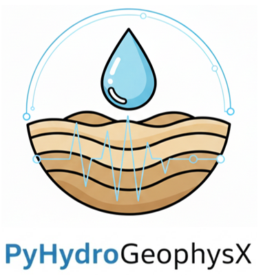

PyHydroGeophysX Documentation
==============================

|

.. image:: https://img.shields.io/badge/python-3.8+-blue.svg
   :target: https://www.python.org/downloads/
   :alt: Python Version

.. image:: https://img.shields.io/badge/License-MIT-yellow.svg
   :target: https://opensource.org/licenses/MIT
   :alt: License

What is PyHydroGeophysX?
------------------------

**PyHydroGeophysX** is a Python package for integrating hydrological model outputs
with geophysical forward modeling and inversion—designed for researchers and 
practitioners working on watershed monitoring, groundwater characterization, and
hydrogeophysical modeling.

If you work with **MODFLOW** or **ParFlow** hydrological models and want to 
simulate or invert **ERT**, **SRT**, or **TDEM** geophysical data, this package 
provides a complete workflow from hydrology to geophysics.

🚀 Key Workflows
----------------

PyHydroGeophysX supports three primary use cases:

1. **Field ERT QC & Export**
   
   Load field ERT data from commercial instruments (Syscal, ABEM, E4D, etc.),
   perform quality control with diagnostic plots, and export to inversion formats.

2. **Hydro Model → Petrophysics → Geophysics**
   
   Load MODFLOW/ParFlow outputs, convert water content to resistivity or velocity
   using petrophysical models (Archie, Waxman-Smits, DEM), and run forward modeling.

3. **Time-Lapse & Structure-Constrained Inversion**
   
   Perform time-lapse ERT inversion with temporal regularization, or use seismic
   velocity interfaces to constrain resistivity inversion for improved imaging.

📦 Quick Install
----------------

.. code-block:: bash

   # From PyPI
   pip install PyHydroGeophysX

   # From source (for latest features)
   git clone https://github.com/geohang/PyHydroGeophysX.git
   cd PyHydroGeophysX
   pip install -e .

⚡ Minimal Example
------------------

.. code-block:: python

   import numpy as np
   from PyHydroGeophysX.model_output import MODFLOWWaterContent
   from PyHydroGeophysX.petrophysics import water_content_to_resistivity

   # Load MODFLOW water content
   processor = MODFLOWWaterContent("path/to/modflow", idomain)
   wc = processor.load_timestep(0)

   # Convert to resistivity using Archie's law
   resistivity = water_content_to_resistivity(
       water_content=wc,
       rho_saturated=100.0,
       saturation_exponent_n=2.0,
       porosity=0.3
   )

   print(f"Resistivity range: {resistivity.min():.1f} - {resistivity.max():.1f} Ohm-m")

🌟 Key Features
---------------

.. list-table::
   :header-rows: 1
   :widths: 30 70

   * - Feature
     - Description
   * - **ERT Data Processing**
     - Load field data from 14+ commercial instruments with RESIPY integration
   * - **Multi-Agent AI System** *(NEW)*
     - Automated cross-modal geophysics workflows with LLM support
   * - **3D ERT Modeling** *(NEW)*
     - Complete 3D mesh creation, forward modeling, and PyVista visualization
   * - **TDEM Forward & Inversion** *(NEW)*
     - Time-Domain Electromagnetic modeling using SimPEG
   * - **Petrophysical Models**
     - Archie, Waxman-Smits, DEM, Hertz-Mindlin rock physics models
   * - **Time-Lapse Inversion**
     - Temporal regularization for monitoring applications
   * - **Structure-Constrained Inversion**
     - Use seismic interfaces to constrain ERT inversion
   * - **Uncertainty Quantification**
     - Monte Carlo methods for parameter uncertainty

📚 Documentation
----------------

.. toctree::
   :maxdepth: 2
   :caption: Getting Started

   installation
   quickstart

.. toctree::
   :maxdepth: 2
   :caption: Tutorials & Workflows

   tutorials/index

.. toctree::
   :maxdepth: 2
   :caption: Examples Gallery

   auto_examples/index

.. toctree::
   :maxdepth: 2
   :caption: Multi-Agent AI System

   agents/index

.. toctree::
   :maxdepth: 2
   :caption: API Reference

   api/index

Indices and Tables
==================

* :ref:`genindex`
* :ref:`modindex`
* :ref:`search`