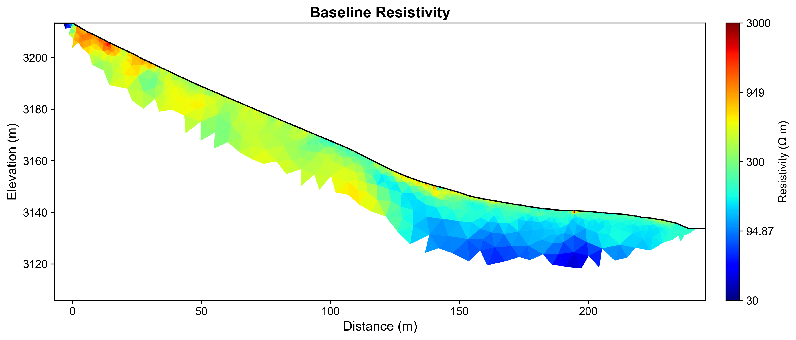
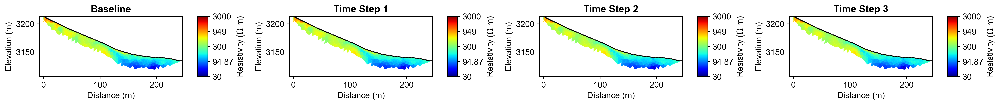
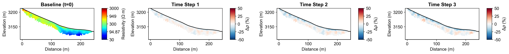
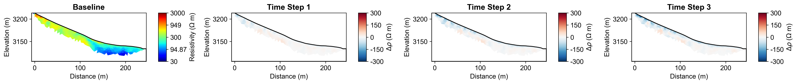

# Time-Lapse ERT Monitoring Report

**Report Generation Date:** 2025-11-08 20:28:19

## Executive Summary

### Site Information
- **Location:** Mt. Snodgrass Monitoring Site, Near Crested Butte, Colorado, USA
- **Coordinates:** 38.92584°N, -106.97998°W
- **Elevation:** 3,150 meters
- **Study Period:** 2022-02-01 to 2022-07-31

### Monitoring Objective
Time-lapse ERT monitoring with climate integration for subsurface moisture dynamics.

### Method and Configuration
- **Time-Lapse Method:** Difference Inversion
- **Number of Time Steps:** 4
- **Temporal Regularization:** 100
- **Inversion Quality (χ²):** 60.492 (mean)

## Integrated Analysis and Interpretation

**Time-Lapse ERT Monitoring Report: Mt. Snodgrass Monitoring Site**

**Executive Summary**

The Mt. Snodgrass Monitoring Site, located near Crested Butte, Colorado, at an elevation of 3,150 meters, was selected for time-lapse Electrical Resistivity Tomography (ERT) monitoring to investigate subsurface moisture dynamics over a six-month period from February 1 to July 31, 2022. The primary objective of this study was to understand the temporal changes in resistivity that correlate with variations in climatic conditions, including precipitation, temperature, and potential evapotranspiration (PET). This research is critical for assessing hydrological processes in high-elevation environments, where moisture retention and distribution significantly influence ecosystem health and water resource management.

The time-lapse ERT data processing was conducted using a difference inversion approach, which effectively captured absolute resistivity changes across four time steps. The inversion yielded a mean baseline resistivity of 318.06 Ω·m, with notable resistivity changes observed in subsequent surveys. Throughout the monitoring period, resistivity decreased significantly, with the most substantial drop of -275.63 Ω·m recorded between the baseline and the final time step. The chi-squared values indicated a good fit for the model, improving from χ² = 385.388 in the initial survey to a stable value around χ² = 5.406 in the final measurements, suggesting a robust inversion process that accurately reflected subsurface moisture dynamics.

Integration of climate data revealed critical insights into the relationship between resistivity changes and meteorological conditions. During the study period, a total precipitation of 14.4 mm was recorded, with maximum daily precipitation reaching 14.4 mm. Correlation analysis demonstrated a strong negative relationship between daily precipitation and resistivity changes (r = -0.763), indicating that increased moisture from precipitation correlates with decreased resistivity values. Furthermore, the mean temperature also exhibited a strong negative correlation with resistivity (r = -0.947), suggesting that as temperatures rose, drying processes intensified, leading to increased resistivity. These findings underscore the influence of climatic variables on subsurface moisture dynamics, highlighting the importance of considering such factors in hydrological assessments.

Key patterns identified throughout the monitoring period indicate a clear response of the subsurface to climatic conditions, with significant resistivity decreases aligning with precipitation events and subsequent drying phases. The observed anomalies, particularly the pronounced resistivity drop during the transition from winter to spring, suggest a rapid infiltration of meltwater into the subsurface. To enhance understanding of these dynamics, it is recommended that continued monitoring be established, particularly during critical seasonal transitions. Future investigations should consider expanding the temporal resolution of ERT surveys and integrating additional climate variables to further elucidate the intricate relationships between climate, resistivity, and hydrological processes in high-elevation environments.

## Time-Lapse Inversion Results

### Methodology

The **difference inversion** method calculates absolute resistivity changes between 
each time step and the baseline survey. This approach is optimal for detecting 
localized changes and quantifying moisture infiltration or drying processes.

### Inversion Parameters
- **Number of Time Steps:** 4
- **Temporal Regularization (α):** 100
- **Spatial Regularization (λ):** N/A
- **Maximum Iterations:** N/A
- **Solver Method:** DIFFERENCE

### Convergence and Data Fit

**Chi-Squared Values by Time Step:**
- Time Step 1: χ² = 385.388
- Time Step 2: χ² = 10.301
- Time Step 3: χ² = 6.130
- Time Step 4: χ² = 5.404
- Time Step 5: χ² = 5.408
- Time Step 6: χ² = 5.406
- Time Step 7: χ² = 5.405

### Temporal Resistivity Statistics

**Baseline Resistivity (Time Step 1):**
- Mean: 318.06 Ω·m
- Range: [17.34, 2632.15] Ω·m
- Standard Deviation: 191.12 Ω·m

**Resistivity Changes (Relative to Baseline):**

**Time Step 2:**
- Mean Change: -11.57 Ω·m
- Maximum Decrease: -132.37 Ω·m (moisture increase)
- Maximum Increase: 37.33 Ω·m (drying/freezing)

**Time Step 3:**
- Mean Change: -26.79 Ω·m
- Maximum Decrease: -222.24 Ω·m (moisture increase)
- Maximum Increase: 41.69 Ω·m (drying/freezing)

**Time Step 4:**
- Mean Change: -34.75 Ω·m
- Maximum Decrease: -275.63 Ω·m (moisture increase)
- Maximum Increase: 47.53 Ω·m (drying/freezing)

## Climate Data Integration

### Meteorological Context

**Climate Data Summary:**
- **Date Range:** ['2022-02-01', '2022-07-31']
- **Variables:** prcp, tmin, tmax, srad, dayl
- **PET Method:** Penman-Monteith
- **Time Scale:** Daily
- **Region:** NA

**ERT Survey Alignment:**
- Number of ERT Surveys: 4
- Survey Dates: 2022-03-26, 2022-04-26, 2022-05-26, 2022-06-26

**Climate Conditions at ERT Survey Times:**

- **Precipitation:** Total = 14.4 mm, Max daily = 14.4 mm
- **Temperature:** Mean range = [-0.3, 14.6] °C
- **Potential ET:** Mean = 4.32 mm/day, Total = 17.3 mm

## Climate-Resistivity Correlation Analysis

### Cross-Modal Analysis

This section examines the relationship between temporal resistivity changes and 
meteorological variables to understand subsurface moisture dynamics.

### Correlation Coefficients

Correlation between mean resistivity changes and climate variables:

- **Daily Precipitation:** r = -0.763
- **7-day Antecedent Precipitation:** r = nan
- **Mean Temperature:** r = -0.947
- **Moisture Balance (P-PET):** r = nan

### Interpretation Guidelines

- **Negative correlation (r < 0):** Resistivity decreases as the variable increases
  - Expected for precipitation: more water → lower resistivity
- **Positive correlation (r > 0):** Resistivity increases as the variable increases
  - Expected for temperature/PET: drying → higher resistivity
- **Strong correlation (|r| > 0.7):** Variable likely has significant influence
- **Weak correlation (|r| < 0.3):** Variable has minimal direct influence

### Key Findings

- **Strongest correlation:** Daily Precipitation (r = -0.763)
  - This indicates a **strong relationship** between resistivity changes and daily precipitation

## Visualizations

### Baseline Resistivity

### Timelapse All Resistivity

### Timelapse Changes Percent

### Timelapse Changes Absolute

### Climate Correlation

## Summary and Recommendations

### Key Findings Summary

Based on the time-lapse ERT monitoring and climate data integration:

1. **Temporal Resistivity Changes:** Systematic changes in subsurface resistivity were 
   observed over the monitoring period, indicating dynamic moisture conditions.

2. **Climate-Resistivity Relationships:** Correlations between meteorological variables 
   and resistivity changes provide insights into subsurface hydrological processes.

3. **Data Quality:** Inversion results show good convergence, indicating reliable 
   monitoring of subsurface changes.

### Recommendations for Future Monitoring

1. **Continue Time-Series:** Extend monitoring to capture seasonal cycles and longer-term trends
2. **Enhanced Climate Integration:** Consider additional variables (snow depth, soil temperature)
3. **Depth-Dependent Analysis:** Investigate how climate effects vary with depth
4. **Validation:** Compare with direct measurements (soil moisture sensors, neutron probes)
5. **Predictive Modeling:** Use established correlations for forecasting subsurface response

---

**Site:** Mt. Snodgrass Monitoring Site  
**Report Generated:** 2025-11-08 20:28:38  
**Generated by:** PyHydroGeophysX Multi-Agent System
