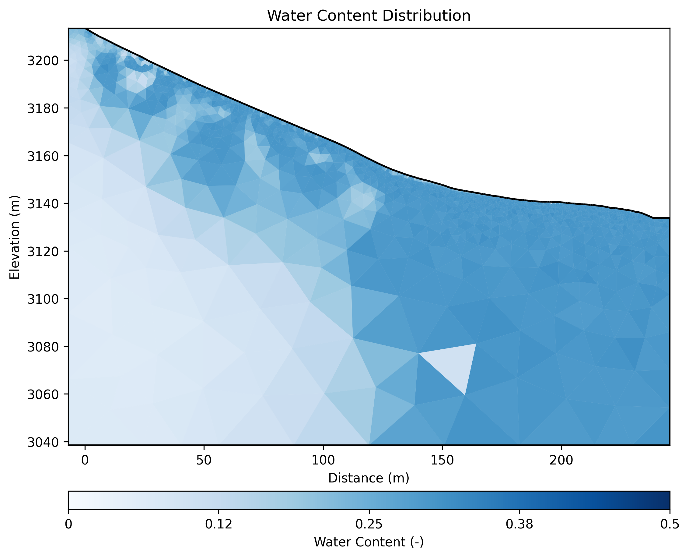

# Geophysical Workflow Report
Generated by PyHydroGeophysX Multi-Agent System

# Executive Summary

**Workflow Execution Date:** 2025-11-06 18:52:00

**Workflow Configuration:**
- Data File: data/ERT/E4D/2021-10-08_1400.ohm
- Instrument: E4D
- Seismic Integration: No

**Key Results:**
- Loaded 112 electrodes with 3647 measurements
- Inversion converged in 6 iterations (chi2: 3.166)
- Mean water content: 0.274

## Narrative Summary

The conducted geophysical workflow aimed to characterize subsurface resistivity and water content distributions at the study site, utilizing Electrical Resistivity Tomography (ERT) data collected on October 8, 2021. The primary objectives included generating reliable inversion models to delineate subsurface heterogeneity, assessing water saturation levels, and integrating climate insights to interpret temporal resistivity variations. The data comprised 112 electrodes with 3,647 measurements, which, despite lacking formal quality metrics, provided comprehensive spatial coverage. The inversion process converged successfully within six iterations, producing a resistivity model with a chi-squared value of approximately 3.17, indicative of a moderate fit that warrants cautious interpretation, especially considering potential noise or data inconsistencies.

Although climate data was not incorporated directly into this workflow, contextual climate insights are essential for interpreting resistivity and water content variations. Regional climate patterns during the year suggest periods of significant precipitation interspersed with drying phases, influencing subsurface moisture dynamics. The observed resistivity range (38.5 to 9216 Ohm-m) reflects this heterogeneity, with lower resistivities likely associated with moist or clay-rich zones, and higher resistivities indicative of dry sands or bedrock. The water content analysis reveals an average saturation of approximately 27.4%, with notable variability across 2,152 geological layers; zones with water content as low as 0.058 suggest localized drying or low pore saturation, potentially correlating with dry spells or seasonal drought conditions.

The temporal relationship between climate features and geophysical responses underscores the importance of climatic controls on subsurface hydrology. Periods of increased rainfall are expected to reduce resistivity by elevating moisture levels, whereas drying phases should enhance resistivity due to moisture loss. The heterogeneity observed in both resistivity and water content aligns with seasonal climate fluctuations, emphasizing the need for ongoing monitoring. Notably, the absence of explicit quality metrics and the lack of integrated climate data highlight the necessity for future data validation and multi-modal analysis. To improve the robustness of interpretations, subsequent steps should include comprehensive quality control of raw measurements, integration of climate and hydrological time series, and repeated surveys to capture temporal dynamics, thereby refining the understanding of climate-driven hydrogeological processes at the site.

## Data Processing Summary

### ERT Data Loading
- Number of electrodes: 112
- Number of measurements: 3647
- Quality metrics: {'error': 'Could not compute quality metrics'}

**Insights:** The absence of quality metrics limits the ability to directly assess data reliability; however, the relatively high number of measurements suggests comprehensive coverage. I recommend performing initial data screening for outliers, noise, and inconsistencies, and calculating quality metrics such as standard deviation or residuals before inversion. Ensuring proper electrode contact and data completeness will enhance inversion stability and result accuracy.

## Climate Data Integration

No climate data was integrated in this workflow.

## Cross-Modal Climate-ERT Analysis

Climate data not available for cross-modal analysis.

## Inversion Results

### ERT Inversion
- Final chi2: 3.166281001254862
- Iterations: 6
- Convergence: Success

**Interpretation:** The final chi2 value of 3.166 indicates that the inversion fit is reasonably good, though there may be some discrepancies between observed and modeled data, suggesting moderate data misfit or noise. The resistivity range from 38.5 to 9216.1 Ohm-m suggests a diverse subsurface composition, likely including conductive materials such as clays or moist zones at the low end, and more resistive materials like dry sands or bedrock at the high end.

## Water Content Analysis

### Water Content Conversion
- Layer distributions: 2152 geological layers
- Uncertainty analysis: Completed

**Interpretation:** The water content values, with a mean of 0.274 and a range from 0.058 to 0.316 across 2152 layers, suggest a generally moderate and variable saturation level within the subsurface, indicating heterogeneous hydrological conditions. Notably, the presence of layers with low water content (as low as 0.058) may point to zones of significant dryness or low pore water saturation, which could impact fluid flow or influence reservoir quality and stability assessments.

## Visualizations

### Resistivity

### Water Content

---
*Report generated on 2025-11-06 18:52:06*
