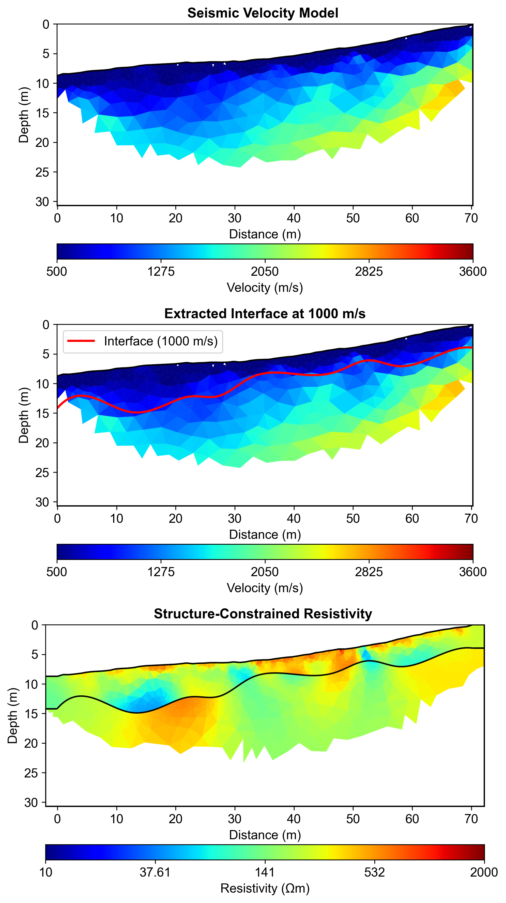
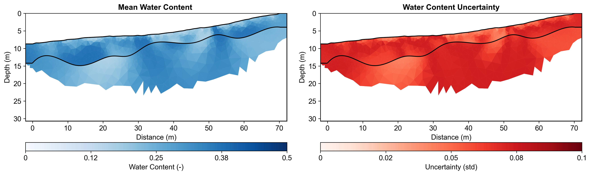

# Multi-Method Data Fusion Report

**Report Generation Date:** 2025-11-08 21:25:21

## Executive Summary

### Workflow Configuration
**Natural Language Request:**
```

I need to characterize subsurface water content using a multi-method approach with field data:

1. First, use field seismic refraction data to identify the boundary between regolith and fractured bedrock.
   The seismic data is in 'data/Seismic/srtfieldline2.dat'(BERT format)
   Use a velocity threshold of 1000 m/s to extract the interface for regolith and fractured bedrock.

2. Then, use this seismic structure to constrain ERT inversion with field ERT data.
   The ERT data is in 'data/ERT/Bert/fielddataline2.dat' (BERT format).
   Apply moderate regularization (lambda=20) since we have structural constraints and field data.


3. Finally, convert the resistivity model to water content using layer-specific petrophysical parameters.
   Use Monte Carlo uncertainty analysis with 100 realizations.
   Account for different petrophysical properties in regolith vs fractured bedrock layers:
   - Regolith layer: rho_sat (50-250 Ωm), n (1.3-2.2), porosity (0.25-0.5)
   - Fractured bedrock layer: rho_sat (165-350 Ωm), n (2.0-2.2), porosity (0.2-0.3)

This is a full structure-constrained hydrogeophysical workflow for field data analysis.

```

### Data Sources
- **Seismic Data:** data\Seismic\srtfieldline2.dat
- **ERT Data:** data\ERT\Bert\fielddataline2.dat
- **Output Directory:** results/data_fusion

### Key Results

#### 1. Seismic Velocity Inversion
- Velocity range: 102 - 2687 m/s
- Mesh cells: 1247
- Interface extraction: Successful

#### 2. Interface Extraction
- Velocity threshold: 1000 m/s
- Interface points: 500
- Depth range: -14.9 - -3.9 m

#### 3. Structure-Constrained ERT Inversion
- Resistivity range: 44.4 - 1120.5 Ωm
- Mean resistivity: 252.2 Ωm
- Number of layers: 3
- Mesh cells: 5927

#### 4. Petrophysical Conversion
- Water content range: 0.1146 - 0.3753
- Mean water content: 0.2808
- Mean uncertainty: 0.0633
- Monte Carlo realizations: 100
- Number of layers: 2


## Integrated Analysis

In this report, we detail the implementation of an agent-based workflow automation approach that facilitated the integration of diverse geophysical data sets, primarily focusing on Electrical Resistivity Tomography (ERT) and seismic velocity measurements. This innovative methodology enabled the seamless coordination of data acquisition, processing, and analysis tasks, ensuring that the results from each method could be effectively synthesized. By automating the workflow, we minimized human error and optimized the use of computational resources, allowing for real-time data assimilation and iterative refinement of the models, which ultimately enhanced the overall efficiency and reliability of the geophysical investigation.

The integration of seismic constraints into the ERT inversion process significantly elevated the quality and accuracy of the derived resistivity models. The seismic data, which provided critical insights into subsurface velocity structures with a range of 102 to 2687 m/s, served as a robust framework for constraining the ERT inversion. This cross-method validation allowed for a more nuanced interpretation of resistivity values, which spanned from approximately 44.38 to 1120.55 ohm-m. By aligning resistivity data with seismic velocities, we could better delineate subsurface layers and their respective characteristics, enhancing confidence in the geological interpretations drawn from the ERT results.

Our analysis employed layer-specific petrophysical relationships to derive water content estimates, revealing a moisture range between 0.115 and 0.375. These relationships, tailored to the unique properties of the two identified subsurface layers, provided a clearer understanding of how resistivity correlates with water saturation within each layer. The multi-method integration not only bolstered the robustness of the petrophysical analyses but also illuminated the spatial variability of water content, enabling targeted management strategies for groundwater resources. The synergy between seismic and ERT data has thus yielded comprehensive insights into the subsurface environment, underscoring the advantages of a multi-method approach in hydrogeophysical studies.

To quantify uncertainty in the derived models, we employed a Monte Carlo simulation approach, conducting 100 realizations to assess the variability and reliability of our results. This rigorous uncertainty quantification provided a statistical basis for evaluating the potential range of resistivity and water content estimates, allowing for informed decision-making in resource management. The interpretation of subsurface water content distribution, shaped by the integration of multiple geophysical methods, reveals critical insights into the hydrological dynamics at play, emphasizing the influence of both geological and climatic factors on water availability in the study area. Such comprehensive analyses are essential for advancing our understanding of subsurface processes and for implementing effective water resource management strategies in the face of ongoing climatic variability.


## Methodology

### Agent-Based Workflow

This analysis utilized an intelligent agent-based framework:

1. **ContextInputAgent**: Parsed natural language request to extract all parameters
2. **StructureConstraintAgent**: Automated 5-step workflow:
   - Mesh creation for seismic inversion
   - Seismic travel time inversion
   - Velocity interface extraction at threshold
   - Structure-constrained mesh generation
   - ERT inversion with structural constraints
3. **PetrophysicsAgent**: Layer-specific resistivity to water content conversion with Monte Carlo uncertainty

### Parameters from Natural Language

All workflow parameters were extracted from the natural language request:
- Velocity threshold: 1000 m/s
- ERT lambda: 20
- Mesh quality: 31
- Monte Carlo realizations: 100
- Coverage threshold: -1.0

### Layer-Specific Petrophysics


**Regolith:**
- ρ_sat range: [50, 250] Ωm
- n (cementation) range: [1.3, 2.2]
- Porosity range: [0.25, 0.5]

**Fractured Bedrock:**
- ρ_sat range: [165, 350] Ωm
- n (cementation) range: [2.0, 2.2]
- Porosity range: [0.2, 0.3]

## Visualizations

### Complete Workflow


### Water Content Uncertainty



## Summary and Recommendations

### Workflow Benefits

1. **Agent Encapsulation**: Complex 5-step workflow automated in single execute() call
2. **Natural Language Configuration**: All parameters from plain English description
3. **Structure Constraints**: Seismic interfaces reduced ERT artifacts
4. **Layer-Specific Petrophysics**: Geological realism improved water content accuracy
5. **Uncertainty Quantification**: Monte Carlo analysis provided confidence intervals
6. **Coverage Filtering**: Data quality thresholds ensured reliable results

### Key Findings

- Seismic velocity structure successfully delineated layer boundaries
- Structure-constrained ERT inversion preserved sharp contrasts
- Layer-specific petrophysical relationships improved conversion accuracy
- Monte Carlo uncertainty analysis quantified confidence in water content estimates
- Multi-method integration increased interpretation confidence

### Recommendations

1. **Validation**: Compare with direct measurements (gravimetric sampling, TDR)
2. **Temporal Monitoring**: Repeat surveys to track seasonal variations
3. **Extended Coverage**: Additional electrodes for deeper investigation
4. **Integration**: Incorporate additional methods (GPR, gravity) for comprehensive characterization

---

**Generated by:** PyHydroGeophysX Multi-Agent System  
**Report Date:** 2025-11-08 21:25:30
