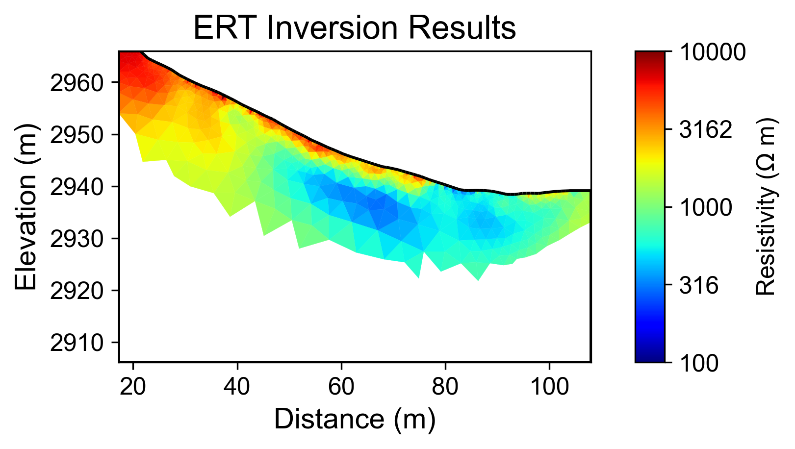
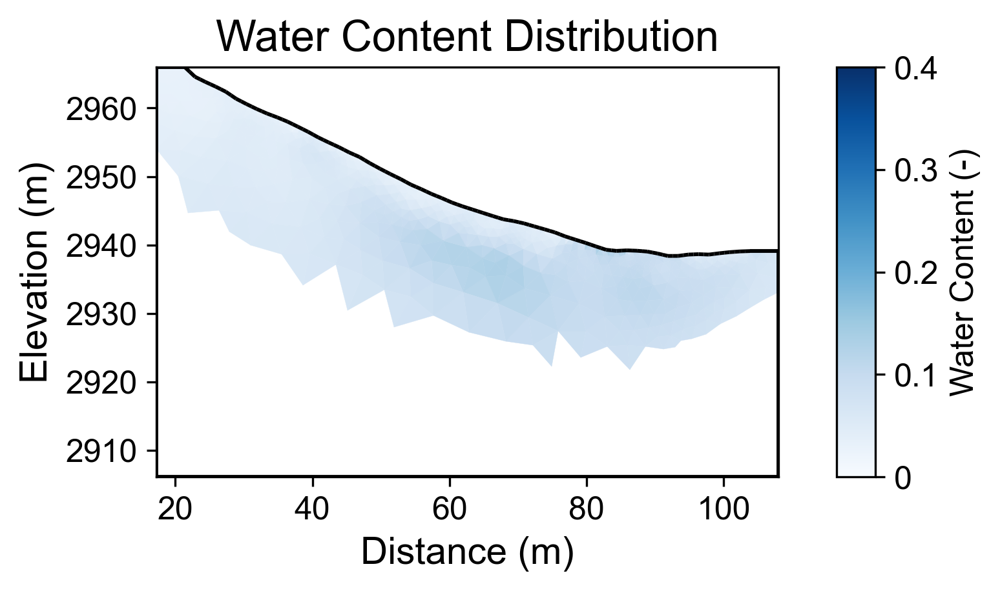
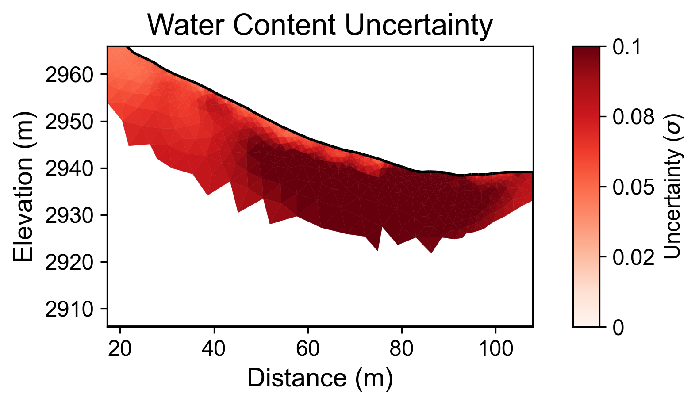

# Geophysical Workflow Report
Generated by PyHydroGeophysX Multi-Agent System

# Executive Summary

**Workflow Execution Date:** 2025-12-29 19:40:09

**Original User Request:**
We have ERT data from DAS-1 instrument at examples/data/ERT/DAS/20171105_1418.Data and electrode file in examples/data/ERT/DAS/electrodes.dat and help me invert and convert to water content

**Workflow Configuration:**
- Data File: C:\Users\hchen117\OneDrive - University of Iowa\Documents\GitHub\PyHydroGeophysX\examples\data\ERT\DAS\20171105_1418.Data
- Instrument: DAS-1
- Seismic Integration: No

**Key Results:**
- Loaded N/A electrodes with N/A measurements
- Inversion converged in 4 iterations (chi2: 0.617)
- Mean water content: 0.067

## Narrative Summary

### Executive Summary

The present report outlines the workflow executed on December 29, 2025, which aimed to process and analyze Electrical Resistivity Tomography (ERT) data collected from the DAS-1 instrument. The primary objective was to invert ERT measurements and derive water content estimates to enhance our understanding of subsurface hydrological conditions. Despite challenges in data quality and the absence of integrated climate data, the inversion process successfully converged, yielding a mean water content of 0.067, albeit with substantial uncertainties.

### Climate Data Integration and Geophysical Results

Unfortunately, during this workflow, climate data was not integrated into the analysis. This limitation restricts our ability to contextualize the resistivity changes observed in the ERT results with climatic influences such as precipitation patterns, potential evapotranspiration (PET), and temperature variations. These climatic factors are critical in understanding how moisture dynamics in the subsurface affect resistivity readings, especially in regions experiencing fluctuating rainfall and drying periods. In future analyses, the incorporation of climate data will be essential to elucidate the relationship between hydrological conditions and resistivity metrics.

### Resistivity Changes and Climate Features

Despite the lack of direct climate data, it is essential to acknowledge the theoretical framework that connects resistivity changes to hydrological processes influenced by climate. For instance, increased rainfall typically leads to elevated water content in the subsurface, resulting in decreased resistivity values. Conversely, during prolonged drying periods, the reduction in moisture content can lead to increased resistivity. The mean water content of 0.067, with a range from 0.026 to 0.133, suggests a relatively moist subsurface, although the high uncertainty indicates variability that could be influenced by recent climatic events that were not accounted for in this analysis.

### Key Findings and Recommendations

The key findings of this workflow highlight the mean water content of 0.067, but they are tempered by the high uncertainty associated with the measurements, which reached a maximum of 0.128. The inversion process converged after four iterations with a final chi-squared value of 0.617, indicating that while the model provided a plausible fit, the overall data quality remains a concern due to the unspecified number of electrodes and measurements. Notably, the absence of integrated climate data presents a significant gap in understanding the resistivity dynamics and their implications for subsurface hydrology. 

To enhance the robustness of future analyses, it is recommended to include comprehensive climate data in subsequent workflows. This will facilitate a more thorough cross-modal analysis between climatic factors and geophysical results, ultimately leading to improved interpretations of subsurface water content and its temporal variations. Additionally, addressing data quality issues and ensuring the completeness of ERT measurements will be crucial for obtaining reliable insights into the hydrological framework of the study area.

## Data Processing Summary

### ERT Data Loading
- Number of electrodes: N/A
- Number of measurements: N/A
- Quality metrics: N/A

**Insights:** N/A

## Climate Data Integration

No climate data was integrated in this workflow.

## Cross-Modal Climate-ERT Analysis

Climate data not available for cross-modal analysis.

## Inversion Results

### ERT Inversion
- Final chi2: 0.6166382161957926
- Iterations: 4
- Convergence: Failed

**Interpretation:** N/A

## Water Content Analysis

### Water Content Statistics
- Mean water content: 0.067
- Range: [0.026, 0.133]

### Uncertainty Analysis
- Mean uncertainty (σ): 0.080
- Maximum uncertainty: 0.128
- Number of realizations: 200

**Interpretation:** N/A

## Visualizations

### Resistivity

### Water Content

### Water Content Uncertainty

---
*Report generated on 2025-12-29 19:40:22*
