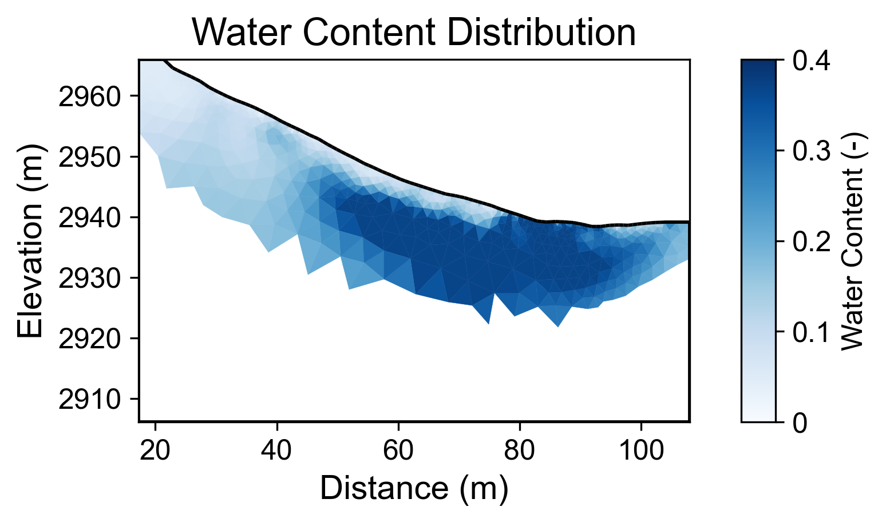
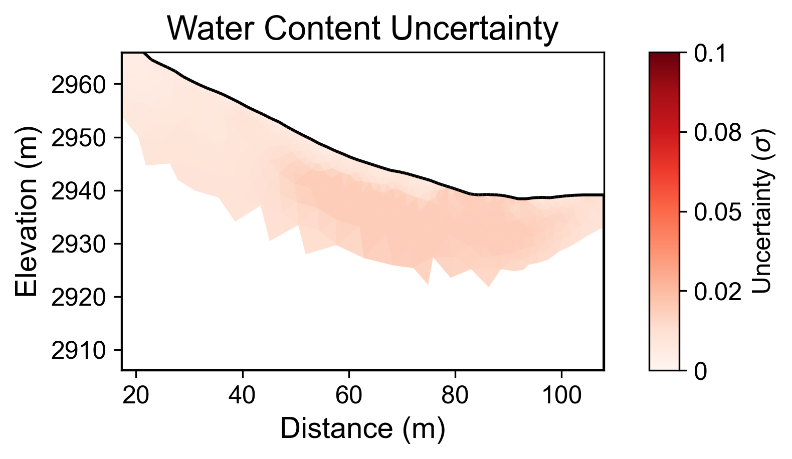

# Geophysical Workflow Report
Generated by PyHydroGeophysX Multi-Agent System

# Executive Summary

**Workflow Execution Date:** 2025-12-29 19:42:18

**Original User Request:**
We have ERT data from DAS-1 instrument at examples/data/ERT/DAS/20171105_1418.Data 
and electrode file in examples/data/ERT/DAS/electrodes.dat 
in the Snowy Range in southeastern Wyoming. The bedrock consists of foliated gneiss in the Cheyenne Belt. 
Use specific petrophysical parameters: rho_sat = 541, porosity = 0.37, n = 1.24

**Workflow Configuration:**
- Data File: C:\Users\hchen117\OneDrive - University of Iowa\Documents\GitHub\PyHydroGeophysX\examples\data\ERT\DAS\20171105_1418.Data
- Instrument: DAS-1
- Seismic Integration: No

**Key Results:**
- Loaded N/A electrodes with N/A measurements
- Inversion converged in 4 iterations (chi2: 0.669)
- Mean water content: 0.197

## Narrative Summary

### Summary of Workflow Results

The primary objective of this workflow was to process and analyze electrical resistivity tomography (ERT) data collected from a Distributed Acoustic Sensing (DAS) instrument in the Snowy Range of southeastern Wyoming. The study site is characterized by a bedrock composition of foliated gneiss located within the Cheyenne Belt. The workflow involved loading ERT data, performing inversions with specified petrophysical parameters (saturated resistivity, porosity, and the cementation exponent), and analyzing the water content of the subsurface. Despite the lack of integrated climate data, the results provide a basis for understanding subsurface conditions and their potential relationship with environmental factors.

The ERT inversion process resulted in a final chi-squared value of approximately 0.669, indicating a moderate fit to the data, although the convergence was deemed insufficient as it failed to meet the required criteria for reliability. The mean water content was calculated at 0.197, with a range from 0.035 to 0.370. The uncertainty analysis revealed a mean uncertainty of 0.012 and a maximum uncertainty of 0.019 across 200 realizations, suggesting a moderate level of confidence in the water content estimates, albeit with inherent variability that should be considered in future interpretations.

Although climate data were not integrated into this analysis, it is essential to contextualize the resistivity changes with respect to climatic influences such as precipitation, potential evapotranspiration (PET), and temperature variations. Notably, periods of increased rainfall typically correlate with higher water content in the subsurface, which would manifest as decreases in resistivity. Conversely, during drying periods, it is expected that the resistivity would increase due to water depletion. Future studies should incorporate local climate data to elucidate these relationships and enhance the interpretation of resistivity anomalies observed in the ERT data.

In summary, while the workflow yielded valuable insights into the subsurface water content, the absence of climate data limits the ability to fully contextualize the resistivity changes. Recommendations for next steps include the acquisition of relevant climate data to facilitate a cross-modal analysis and re-evaluation of the ERT data with improved inversion techniques to enhance convergence. Additionally, further field studies should be conducted to monitor temporal changes in resistivity in relation to climatic events, providing a more comprehensive understanding of the hydrological dynamics at play in this geological setting.

## Data Processing Summary

### ERT Data Loading
- Number of electrodes: N/A
- Number of measurements: N/A
- Quality metrics: N/A

**Insights:** N/A

## Climate Data Integration

No climate data was integrated in this workflow.

## Cross-Modal Climate-ERT Analysis

Climate data not available for cross-modal analysis.

## Inversion Results

### ERT Inversion
- Final chi2: 0.6688565877636887
- Iterations: 4
- Convergence: Failed

**Interpretation:** N/A

## Water Content Analysis

### Water Content Statistics
- Mean water content: 0.197
- Range: [0.035, 0.370]

### Uncertainty Analysis
- Mean uncertainty (σ): 0.012
- Maximum uncertainty: 0.019
- Number of realizations: 200

**Interpretation:** N/A

## Visualizations

### Resistivity

### Water Content

### Water Content Uncertainty

---
*Report generated on 2025-12-29 19:42:29*
