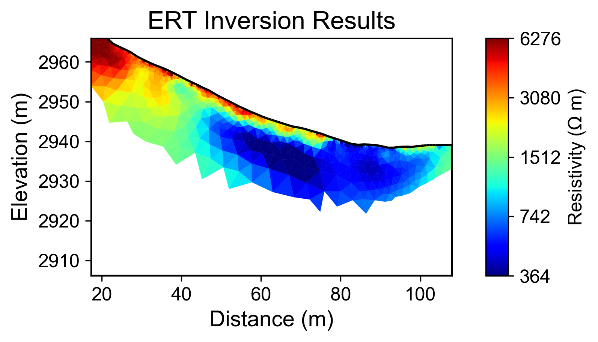
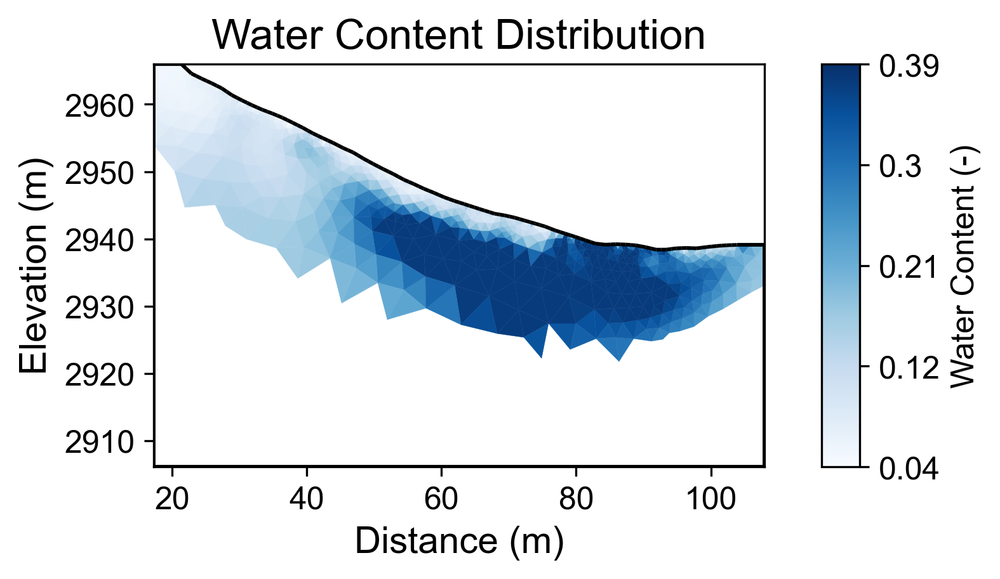
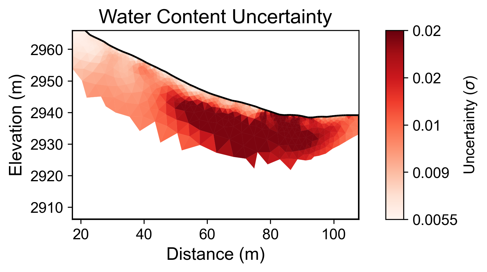

# Geophysical Workflow Report
Generated by PyHydroGeophysX Multi-Agent System

# Executive Summary

**Workflow Execution Date:** 2026-01-20 18:12:46

**Original User Request:**
Run a standard ERT inversion using the DAS-1 instrument.
Data file: 20171105_1418.Data
Electrode file: electrodes.dat
Petrophysics: rho_sat=541, porosity=0.37, n=1.24
Regularization lambda: 15

**Workflow Configuration:**
- Data File: C:\Users\hchen117\AppData\Local\Temp\phgx_uploads_q11fe05u\20171105_1418.Data
- Instrument: DAS-1
- Seismic Integration: No

**Key Results:**
- Loaded 56 electrodes with 930 measurements
- Inversion converged in 4 iterations (chi2: 0.762)
- Mean water content: 0.198

## Narrative Summary

### Executive Summary

This report provides a comprehensive analysis of the Electrical Resistivity Tomography (ERT) data collected using the DAS-1 instrument, focusing on the inversion results, water content analysis, and potential relationships with climate data. The primary objective of this workflow was to generate high-quality resistivity profiles that could inform on subsurface hydrology and geophysical properties. The ERT inversion utilized 56 electrodes and yielded 930 measurements, converging successfully in four iterations with a final chi-squared value of 0.762, indicating a good fit of the model to the observed data. The mean water content derived from the inversion analysis was 0.198, with a range from 0.034 to 0.372.

In terms of climate data integration, it is noteworthy that the current workflow did not incorporate relevant climatic insights, such as precipitation, potential evapotranspiration (PET), and temperature trends. Understanding the relationships between these climatic variables and resistivity changes is crucial for a more nuanced interpretation of the ERT results. For instance, periods of significant rainfall are likely to influence resistivity by increasing the water content in the subsurface, thereby reducing resistivity values. Conversely, during drying periods, where PET may exceed precipitation, we would expect resistivity to increase as water is depleted from the soil matrix.

The analysis revealed a mean water content indicative of a moderately moist subsurface environment. However, without climate data, the ability to contextualize these findings is limited. Future investigations should focus on integrating local climate data to identify correlations between resistivity changes and hydrological responses to climatic events. This integration would enhance our understanding of how seasonal variations in precipitation and temperature impact subsurface water dynamics, potentially revealing patterns that correlate with resistivity anomalies.

In conclusion, while the ERT inversion provided valuable insights into subsurface water content, the absence of integrated climate data presents a significant limitation in fully understanding the observed resistivity variations. Recommendations for next steps include the collection and integration of local climate data to facilitate a cross-modal analysis, which would enhance the interpretative strength of the resistivity profiles. Furthermore, future workflows should consider the timing of measurements relative to climatic events to better assess the dynamic relationship between hydrology and resistivity. This approach will ultimately improve predictive modeling of subsurface conditions in response to changing climatic patterns.

## Data Processing Summary

### ERT Data Loading
- Number of electrodes: 56
- Number of measurements: 930
- Quality metrics: N/A

**Insights:** N/A

## Climate Data Integration

No climate data was integrated in this workflow.

## Cross-Modal Climate-ERT Analysis

Climate data not available for cross-modal analysis.

## Inversion Results

### ERT Inversion
- Final chi2: 0.7615703111373282
- Iterations: 4
- Convergence: Success

**Interpretation:** N/A

## Water Content Analysis

### Water Content Statistics
- Mean water content: 0.198
- Range: [0.034, 0.372]

### Uncertainty Analysis
- Mean uncertainty (σ): 0.012
- Maximum uncertainty: 0.019
- Number of realizations: 100

### Petrophysical Parameters (User-Specified)
**User input parameters:** {'rho_sat': 541.0, 'porosity': 0.37, 'n': 1.24}

**Parameters used per layer (means +/- std):**
- **Regolith**: ρ_sat=541.000 ± 2.705 Ωm, n=1.240 ± 0.062, φ=0.370 ± 0.018

**Interpretation:** N/A

## Visualizations

### Resistivity

### Water Content

### Water Content Uncertainty

---
*Report generated on 2026-01-20 18:12:56*
