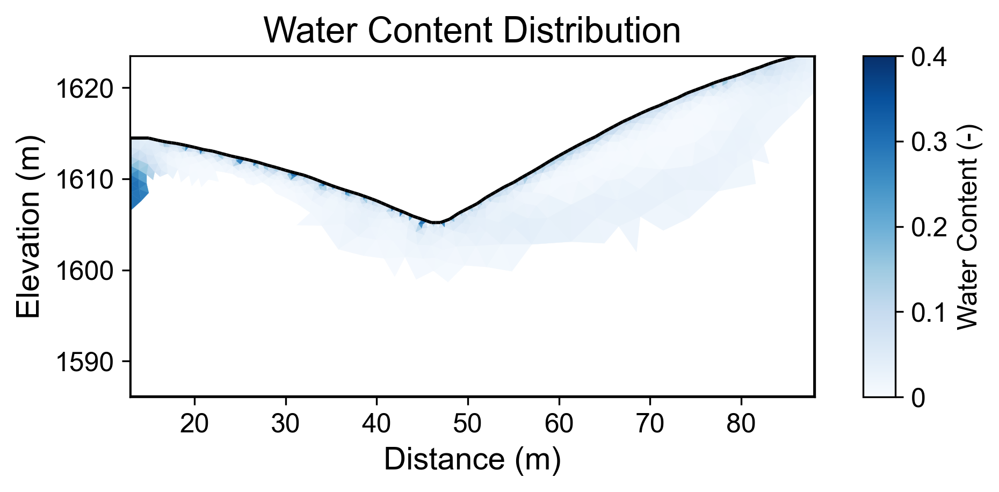
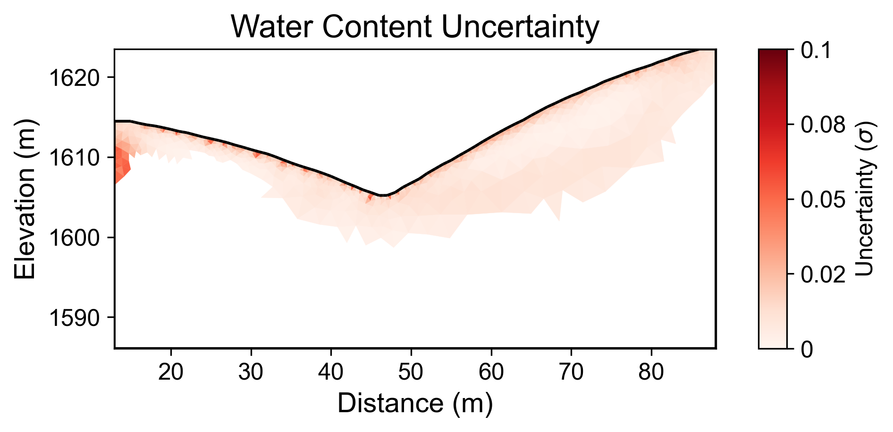

# Geophysical Workflow Report
Generated by PyHydroGeophysX Multi-Agent System

# Executive Summary

**Workflow Execution Date:** 2025-12-29 16:37:27

**Original User Request:**
Not provided

**Workflow Configuration:**
- Data File: results\synthetic_benchmark\synthetic_benchmark.dat
- Instrument: BERT
- Seismic Integration: No

**Key Results:**
- Loaded N/A electrodes with N/A measurements
- Inversion converged in 10 iterations (chi2: 3.582)
- Mean water content: 0.046

## Narrative Summary

### Summary of Workflow Results

The primary objective of the executed workflow was to process Electrical Resistivity Tomography (ERT) data to analyze subsurface resistivity variations, with an emphasis on deriving insights related to water content within the study area. The analysis utilized a synthetic benchmark dataset, although specific details regarding the number of electrodes and measurements were not provided. The inversion process, while successful in converging over 10 iterations, yielded a final chi-square value of 3.582, indicating potential challenges in achieving a robust fit to the observed data. The mean water content calculated from the analysis was 0.046, with a range spanning from 0.002 to 0.305. However, the absence of quality metrics and climate data integration presents limitations in contextualizing these findings.

A critical aspect of understanding resistivity changes lies in integrating climate data, specifically precipitation, potential evapotranspiration (PET), and temperature variations. Unfortunately, the current workflow did not incorporate climate data, which restricts the ability to draw correlations between climatic conditions and resistivity changes. In typical scenarios, increased rainfall generally leads to elevated water content in the subsurface, resulting in lower resistivity values. Conversely, during drying periods, the reduction in moisture can lead to higher resistivity. The lack of climate data in this analysis precludes a thorough investigation of these expected relationships.

The mean water content observed, while indicating some level of subsurface moisture, suggests a relatively low saturation state within the study area. The range of water content values signifies variability that could correlate with past climatic events, such as rainfall patterns or periods of drought. However, without the pertinent climate context, it is difficult to ascertain whether the observed resistivity values are indicative of recent hydrological changes or historical conditions. Furthermore, the uncertainty analysis, with a mean uncertainty of 0.012 and a maximum of 0.055, highlights the need for caution in interpreting these results, as they may not fully capture the complexities of subsurface hydrology.

Moving forward, it is highly recommended to incorporate climate data into future workflows to facilitate a more comprehensive analysis of resistivity changes in relation to hydrological dynamics. This integration would allow for a more robust interpretation of resistivity anomalies and their potential linkages to climatic influences. Additionally, addressing the data quality caveats and enhancing the resolution of ERT measurements would strengthen the reliability of the results. Future studies should aim to develop a cohesive dataset that combines geophysical and climate variables to elucidate the interactions between subsurface water content and environmental conditions.

## Data Processing Summary

### ERT Data Loading
- Number of electrodes: N/A
- Number of measurements: N/A
- Quality metrics: N/A

**Insights:** N/A

## Climate Data Integration

No climate data was integrated in this workflow.

## Cross-Modal Climate-ERT Analysis

Climate data not available for cross-modal analysis.

## Inversion Results

### ERT Inversion
- Final chi2: 3.5820277941313052
- Iterations: 10
- Convergence: Failed

**Interpretation:** N/A

## Water Content Analysis

### Water Content Statistics
- Mean water content: 0.046
- Range: [0.002, 0.305]

### Uncertainty Analysis
- Mean uncertainty (σ): 0.012
- Maximum uncertainty: 0.055
- Number of realizations: 100

**Interpretation:** N/A

## Visualizations

### Resistivity

### Water Content

### Water Content Uncertainty

---
*Report generated on 2025-12-29 16:37:40*
