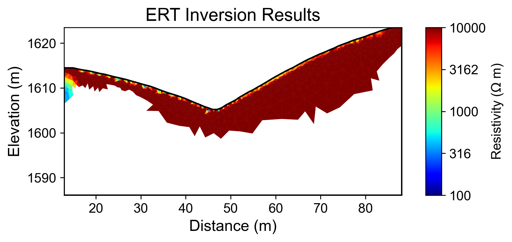
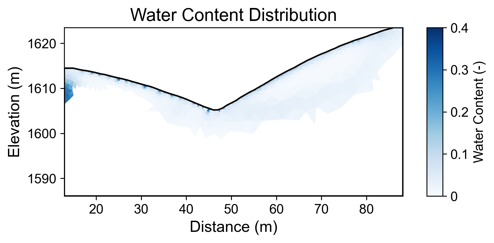
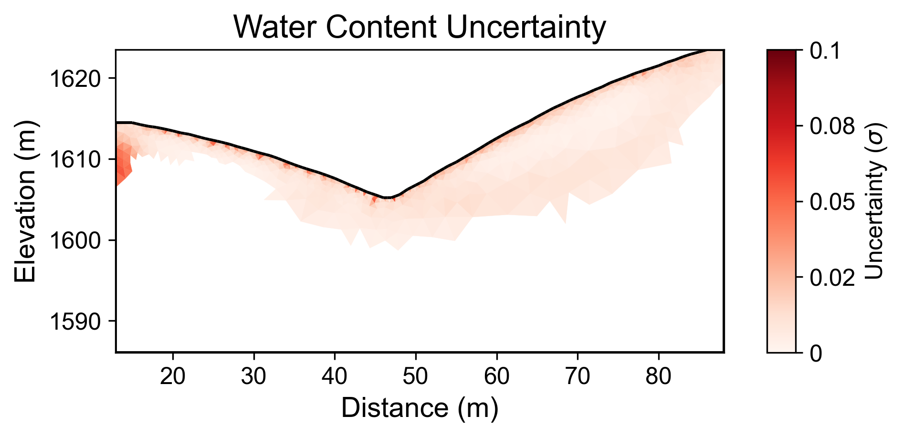

# Geophysical Workflow Report
Generated by PyHydroGeophysX Multi-Agent System

# Executive Summary

**Workflow Execution Date:** 2025-12-29 16:44:21

**Original User Request:**
Not provided

**Workflow Configuration:**
- Data File: results\synthetic_benchmark\synthetic_benchmark.dat
- Instrument: BERT
- Seismic Integration: No

**Key Results:**
- Loaded N/A electrodes with N/A measurements
- Inversion converged in 10 iterations (chi2: 3.582)
- Mean water content: 0.046

## Narrative Summary

### Executive Summary

This report outlines the results of the Electrical Resistivity Tomography (ERT) workflow executed on December 29, 2025, with the primary objective of analyzing subsurface resistivity variations to infer water content and potential implications for hydrological studies. The ERT data was processed using the BERT instrument, although it is important to note that no climate data was integrated into this analysis, which limits the contextual understanding of resistivity changes related to climatic factors. The inversion process completed in 10 iterations with a final chi-squared value of 3.582, indicating a convergence failure, which suggests that the model may not have adequately fit the observed data.

### Climate Data Insights and ERT Results

Despite the absence of integrated climate data in this workflow, the relationship between resistivity changes and climatic factors such as precipitation and temperature is critical for interpreting subsurface water content. Typically, increased rainfall leads to higher water content in the soil, causing a decrease in resistivity due to the conductive nature of water. Conversely, drying periods characterized by increased potential evapotranspiration (PET) can lead to reduced water content and, subsequently, an increase in resistivity. The mean water content observed in this analysis was 0.046, with a range from 0.002 to 0.302, indicating variability that could be influenced by such climatic conditions.

### Key Findings and Climate Context

The mean water content value of 0.046 suggests a relatively low moisture level in the subsurface, which might reflect a period of limited precipitation leading up to the analysis. However, without corresponding climate data, it is challenging to definitively correlate the observed resistivity changes to specific climatic events. The range of water content values indicates potential heterogeneity in subsurface conditions that may be influenced by localized rainfall patterns or drying events. Notably, the inversion's convergence failure suggests that further refinement of the model is necessary, and may be improved by incorporating climate data to enhance the understanding of resistivity variations.

### Recommendations and Data Quality Caveats

The lack of climate data integration in this workflow presents a significant caveat, as it limits the interpretability of the resistivity results and their relation to hydrological conditions. Future analyses should prioritize the inclusion of relevant climate datasets, including historical and real-time precipitation, temperature, and PET data, to provide a comprehensive context for resistivity changes. Additionally, it may be beneficial to reassess the data quality metrics, as the absence of electrode and measurement quantities raises concerns regarding the reliability of the inversion results. Moving forward, a more robust data collection strategy, along with enhanced integration of climate variables, is recommended to facilitate a clearer understanding of the subsurface hydrology and its response to climatic influences.

## Data Processing Summary

### ERT Data Loading
- Number of electrodes: N/A
- Number of measurements: N/A
- Quality metrics: N/A

**Insights:** N/A

## Climate Data Integration

No climate data was integrated in this workflow.

## Cross-Modal Climate-ERT Analysis

Climate data not available for cross-modal analysis.

## Inversion Results

### ERT Inversion
- Final chi2: 3.582027794579537
- Iterations: 10
- Convergence: Failed

**Interpretation:** N/A

## Water Content Analysis

### Water Content Statistics
- Mean water content: 0.046
- Range: [0.002, 0.302]

### Uncertainty Analysis
- Mean uncertainty (σ): 0.012
- Maximum uncertainty: 0.056
- Number of realizations: 100

**Interpretation:** N/A

## Visualizations

### Resistivity

### Water Content

### Water Content Uncertainty

---
*Report generated on 2025-12-29 16:44:35*
