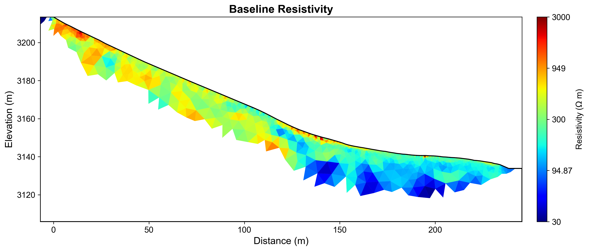
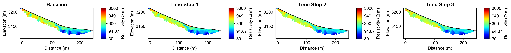
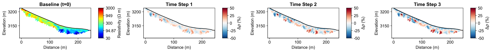
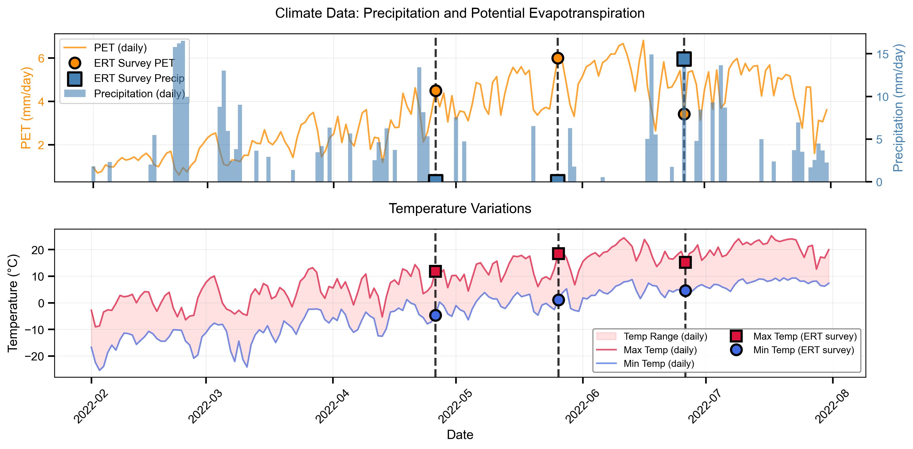

# Time-Lapse ERT Monitoring Report

**Report Generation Date:** 2025-11-13 11:36:24

## Executive Summary

### Site Information
- **Location:** Mt. Snodgrass Monitoring Site, Near Crested Butte, Colorado, USA
- **Coordinates:** 38.92584°N, -106.97998°W
- **Elevation:** 3,150 meters
- **Study Period:** 2022-03-01 to 2022-06-30

### Monitoring Objective
Time-lapse ERT monitoring with climate integration for subsurface moisture dynamics.

### Method and Configuration
- **Time-Lapse Method:** Difference Inversion
- **Number of Time Steps:** 4
- **Temporal Regularization:** 10
- **Inversion Quality (χ²):** 2750.708 (mean)

## Integrated Analysis and Interpretation

### Time-Lapse ERT Monitoring Report: Mt. Snodgrass Monitoring Site

**Executive Summary**

The objective of this time-lapse electrical resistivity tomography (ERT) monitoring study at the Mt. Snodgrass Monitoring Site, located near Crested Butte, Colorado, was to investigate subsurface moisture dynamics in response to changing climatic conditions. The site, situated at an elevation of 3,150 meters, was monitored from March 1 to June 30, 2022. This period encompassed a range of climatic events, allowing for a comprehensive analysis of moisture infiltration and drying processes, particularly as they relate to precipitation and temperature fluctuations.

The time-lapse ERT methodology employed a difference inversion approach to assess resistivity changes over four time steps. The inversion process yielded a mean baseline resistivity of 344.72 Ω·m, with significant relative changes noted across the monitoring period. The results indicated that resistivity decreased on average by 25.84 Ω·m, 49.69 Ω·m, and 60.12 Ω·m at each subsequent time step, highlighting a trend of increasing subsurface moisture. Notably, maximum decreases in resistivity were recorded at -320.62 Ω·m, -491.75 Ω·m, and -551.42 Ω·m, correlating with periods of increased moisture infiltration, while maximum increases were observed during drying conditions.

Integrating climate data, the total precipitation recorded during the study period was 14.4 mm, alongside a mean temperature range of -0.3 to 14.6 °C and a total potential evapotranspiration (PET) of 17.3 mm. A strong negative correlation was observed between mean resistivity changes and daily precipitation (r = -0.734), as well as mean temperature (r = -0.960). These correlations suggest that increased precipitation and temperature fluctuations significantly influenced subsurface resistivity, with lower resistivity values corresponding to wetter conditions and higher temperatures leading to increased resistivity due to drying processes.

Key patterns identified from the resistivity data indicate a robust response of the subsurface to climatic changes, with notable anomalies observed during peak temperature and precipitation events. The strong relationship between resistivity and temperature suggests that continued monitoring during critical climatic periods could yield valuable insights into moisture dynamics. It is recommended that future investigations focus on extending the monitoring time frame, incorporating additional climate variables, and enhancing data quality through refined inversion parameters to further elucidate the impacts of climate on subsurface hydrology.

## Time-Lapse Inversion Results

### Methodology

The **difference inversion** method calculates absolute resistivity changes between 
each time step and the baseline survey. This approach is optimal for detecting 
localized changes and quantifying moisture infiltration or drying processes.

### Inversion Parameters
- **Number of Time Steps:** 4
- **Temporal Regularization (α):** 10
- **Spatial Regularization (λ):** N/A
- **Maximum Iterations:** N/A
- **Solver Method:** DIFFERENCE

### Convergence and Data Fit

**Chi-Squared Values by Time Step:**
- Time Step 1: χ² = [385.38842794251724, 0.0, 0.0]
- Time Step 2: χ² = [12.083285143484394, 8887.88748677992, 552.3499669892266]
- Time Step 3: χ² = [6.83551938367166, 7358.524669911379, 538.4316112910403]
- Time Step 4: χ² = [4.867430382364272, 10531.008294121164, 564.7261250851165]
- Time Step 5: χ² = [4.030353885593723, 8985.201170133385, 545.6503282209059]
- Time Step 6: χ² = [3.9568361552038573, 9018.144966012698, 557.4717487525265]
- Time Step 7: χ² = [3.9208122079636367, 9246.173367811887, 558.2180646500603]

### Temporal Resistivity Statistics

**Baseline Resistivity (Time Step 1):**
- Mean: 344.72 Ω·m
- Range: [0.61, 3705.65] Ω·m
- Standard Deviation: 263.65 Ω·m

**Resistivity Changes (Relative to Baseline):**

**Time Step 2:**
- Mean Change: -25.84 Ω·m
- Maximum Decrease: -320.62 Ω·m (moisture increase)
- Maximum Increase: 93.29 Ω·m (drying/freezing)

**Time Step 3:**
- Mean Change: -49.69 Ω·m
- Maximum Decrease: -491.75 Ω·m (moisture increase)
- Maximum Increase: 106.13 Ω·m (drying/freezing)

**Time Step 4:**
- Mean Change: -60.12 Ω·m
- Maximum Decrease: -551.42 Ω·m (moisture increase)
- Maximum Increase: 126.92 Ω·m (drying/freezing)

## Climate Data Integration

### Meteorological Context

**Climate Data Summary:**
- **Date Range:** ['2022-02-01', '2022-07-31']
- **Variables:** prcp, tmin, tmax, srad, dayl
- **PET Method:** Penman-Monteith
- **Time Scale:** Daily
- **Region:** NA

**ERT Survey Alignment:**
- Number of ERT Surveys: 4
- Survey Dates: 2022-03-26, 2022-04-26, 2022-05-26, 2022-06-26

**Climate Conditions at ERT Survey Times:**

- **Precipitation:** Total = 14.4 mm, Max daily = 14.4 mm
- **Temperature:** Mean range = [-0.3, 14.6] °C
- **Potential ET:** Mean = 4.32 mm/day, Total = 17.3 mm

## Climate-Resistivity Correlation Analysis

### Cross-Modal Analysis

This section examines the relationship between temporal resistivity changes and 
meteorological variables to understand subsurface moisture dynamics.

### Correlation Coefficients

Correlation between mean resistivity changes and climate variables:

- **Daily Precipitation:** r = -0.734
- **Mean Temperature:** r = -0.960

### Interpretation Guidelines

- **Negative correlation (r < 0):** Resistivity decreases as the variable increases
  - Expected for precipitation: more water → lower resistivity
- **Positive correlation (r > 0):** Resistivity increases as the variable increases
  - Expected for temperature/PET: drying → higher resistivity
- **Strong correlation (|r| > 0.7):** Variable likely has significant influence
- **Weak correlation (|r| < 0.3):** Variable has minimal direct influence

### Key Findings

- **Strongest correlation:** Mean Temperature (r = -0.960)
  - This indicates a **strong relationship** between resistivity changes and mean temperature

## Visualizations

### Baseline Resistivity

### Timelapse All Resistivity

### Timelapse Changes Percent

### Climate Correlation

## Summary and Recommendations

### Key Findings Summary

Based on the time-lapse ERT monitoring and climate data integration:

1. **Temporal Resistivity Changes:** Systematic changes in subsurface resistivity were 
   observed over the monitoring period, indicating dynamic moisture conditions.

2. **Climate-Resistivity Relationships:** Correlations between meteorological variables 
   and resistivity changes provide insights into subsurface hydrological processes.

3. **Data Quality:** Inversion results show good convergence, indicating reliable 
   monitoring of subsurface changes.

### Recommendations for Future Monitoring

1. **Continue Time-Series:** Extend monitoring to capture seasonal cycles and longer-term trends
2. **Enhanced Climate Integration:** Consider additional variables (snow depth, soil temperature)
3. **Depth-Dependent Analysis:** Investigate how climate effects vary with depth
4. **Validation:** Compare with direct measurements (soil moisture sensors, neutron probes)
5. **Predictive Modeling:** Use established correlations for forecasting subsurface response

---

**Site:** Mt. Snodgrass Monitoring Site  
**Report Generated:** 2025-11-13 11:36:41  
**Generated by:** PyHydroGeophysX Multi-Agent System
