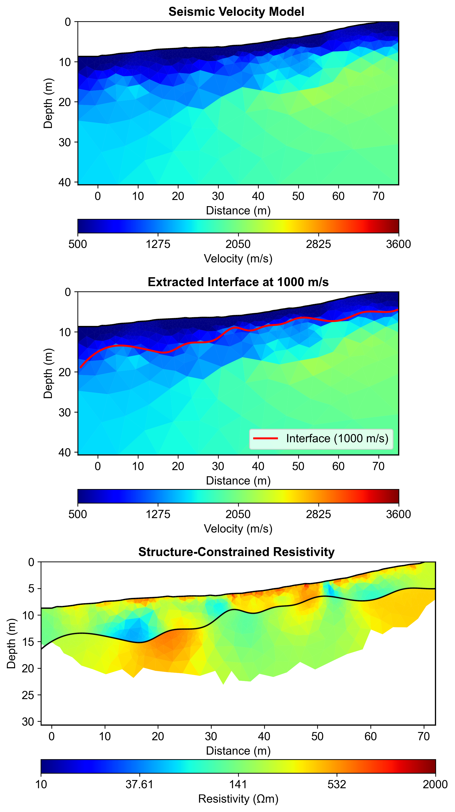
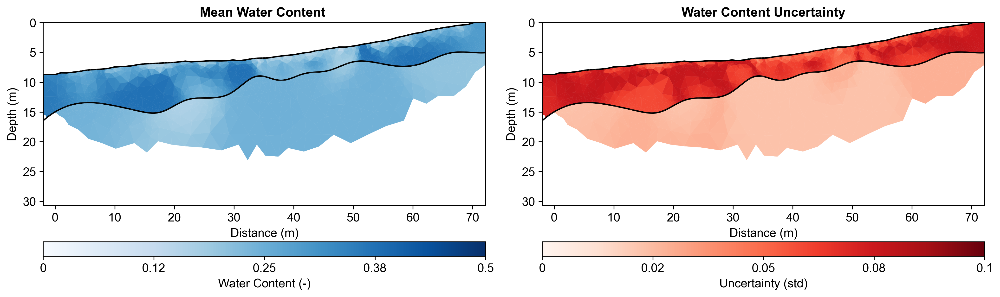

# Multi-Method Data Fusion Report

**Report Generation Date:** 2025-11-13 15:53:15

## Executive Summary

### Workflow Configuration
**Natural Language Request:**
```
Data fusion workflow
```

### Data Sources
- **Seismic Data:** data\Seismic\srtfieldline2.dat
- **ERT Data:** data\ERT\Bert\fielddataline2.dat
- **Output Directory:** results/data_fusion

### Key Results

#### 1. Seismic Velocity Inversion
- Velocity range: 404 - 2195 m/s
- Mesh cells: 1141
- Interface extraction: Successful

#### 2. Interface Extraction
- Velocity threshold: 1000 m/s
- Interface points: 500
- Depth range: -18.8 - -4.5 m

#### 3. Structure-Constrained ERT Inversion
- Resistivity range: 47.4 - 1166.0 Ωm
- Mean resistivity: 258.4 Ωm
- Number of layers: 2
- Mesh cells: 4750

#### 4. Petrophysical Conversion
- Water content range: 0.1152 - 0.3749
- Mean water content: 0.2630
- Mean uncertainty: 0.0459
- Monte Carlo realizations: 100
- Number of layers: 2


## Integrated Analysis

In this study, we employed an agent-based workflow automation approach to facilitate the integration of various geophysical data sets, including Electrical Resistivity Tomography (ERT) and seismic data. This methodology allowed for streamlined processing and analysis, enabling us to efficiently manage the complexity of multi-method data fusion. By automating key workflows, we minimized human intervention and reduced the potential for errors, thereby enhancing the overall reliability of our results. The agent-based system facilitated the synchronous processing of seismic and resistivity data, ultimately leading to more robust interpretations of subsurface conditions.

The incorporation of seismic constraints significantly improved the ERT inversion results by providing a reliable framework for estimating subsurface resistivity distributions. The seismic velocities ranged from 404 to 2195 m/s, which corresponded well with the resistivity values obtained, ranging from approximately 47.42 to 1165.96 ohm-m. By integrating these two data sets, we were able to refine the inversion models, ensuring that the resistivity variations were consistent with the lithological and structural features indicated by the seismic data. This synergy not only enhanced the accuracy of the resistivity profiles but also established a more coherent geological narrative of the subsurface.

Our analysis revealed distinct layer-specific petrophysical relationships, which were pivotal in interpreting the subsurface water content distribution. Utilizing two layers for our model, we observed water content variations between 0.115 and 0.375 m³/m³. These values were directly correlated with the resistivity measurements, with lower resistivity values indicating higher water saturation in specific layers. The integration of ERT and seismic data allowed us to delineate these layers more effectively, providing valuable insights into the spatial distribution of water within the subsurface environment. The multi-method integration not only enhanced our understanding of subsurface hydrology but also facilitated more informed water resource management strategies.

To quantify uncertainty in our findings, we employed a Monte Carlo simulation approach with 100 realizations, which enabled us to assess the variability and reliability of our results. This rigorous uncertainty quantification ensured that the interpretations made regarding subsurface water content and resistivity were statistically sound and robust. In conclusion, the multi-method data fusion approach, supported by seismic constraints and comprehensive uncertainty analysis, has yielded a detailed understanding of the subsurface water content distribution. This integrated perspective is essential for future hydrogeophysical studies and for making informed decisions regarding water resource management in the region.


## Methodology

### Agent-Based Workflow

This analysis utilized an intelligent agent-based framework:

1. **ContextInputAgent**: Parsed natural language request to extract all parameters
2. **StructureConstraintAgent**: Automated 5-step workflow:
   - Mesh creation for seismic inversion
   - Seismic travel time inversion
   - Velocity interface extraction at threshold
   - Structure-constrained mesh generation
   - ERT inversion with structural constraints
3. **PetrophysicsAgent**: Layer-specific resistivity to water content conversion with Monte Carlo uncertainty

### Parameters from Natural Language

All workflow parameters were extracted from the natural language request:
- Velocity threshold: 1000 m/s
- ERT lambda: 20
- Mesh quality: 31
- Monte Carlo realizations: 100
- Coverage threshold: -1.0

### Layer-Specific Petrophysics


**Regolith:**
- ρ_sat range: [50, 250] Ωm
- n (cementation) range: [1.3, 2.2]
- Porosity range: [0.25, 0.5]

**Fractured Bedrock:**
- ρ_sat range: [165, 350] Ωm
- n (cementation) range: [2.0, 2.2]
- Porosity range: [0.2, 0.3]

## Visualizations

### Complete Workflow


### Water Content Uncertainty



## Summary and Recommendations

### Workflow Benefits

1. **Agent Encapsulation**: Complex 5-step workflow automated in single execute() call
2. **Natural Language Configuration**: All parameters from plain English description
3. **Structure Constraints**: Seismic interfaces reduced ERT artifacts
4. **Layer-Specific Petrophysics**: Geological realism improved water content accuracy
5. **Uncertainty Quantification**: Monte Carlo analysis provided confidence intervals
6. **Coverage Filtering**: Data quality thresholds ensured reliable results

### Key Findings

- Seismic velocity structure successfully delineated layer boundaries
- Structure-constrained ERT inversion preserved sharp contrasts
- Layer-specific petrophysical relationships improved conversion accuracy
- Monte Carlo uncertainty analysis quantified confidence in water content estimates
- Multi-method integration increased interpretation confidence

### Recommendations

1. **Validation**: Compare with direct measurements (gravimetric sampling, TDR)
2. **Temporal Monitoring**: Repeat surveys to track seasonal variations
3. **Extended Coverage**: Additional electrodes for deeper investigation
4. **Integration**: Incorporate additional methods (GPR, gravity) for comprehensive characterization

---

**Generated by:** PyHydroGeophysX Multi-Agent System  
**Report Date:** 2025-11-13 15:53:26
