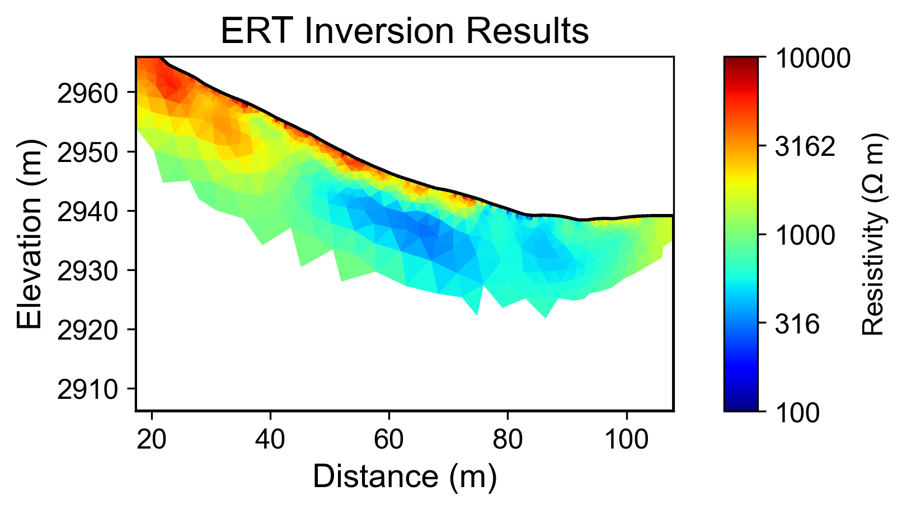
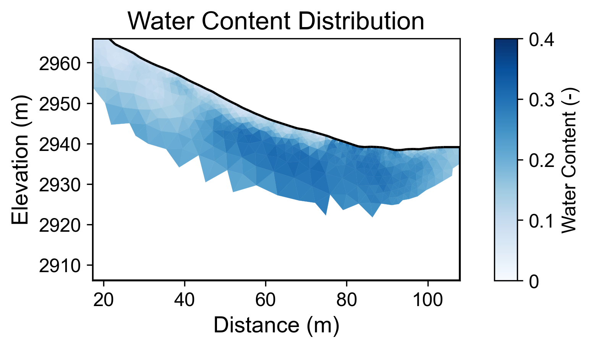
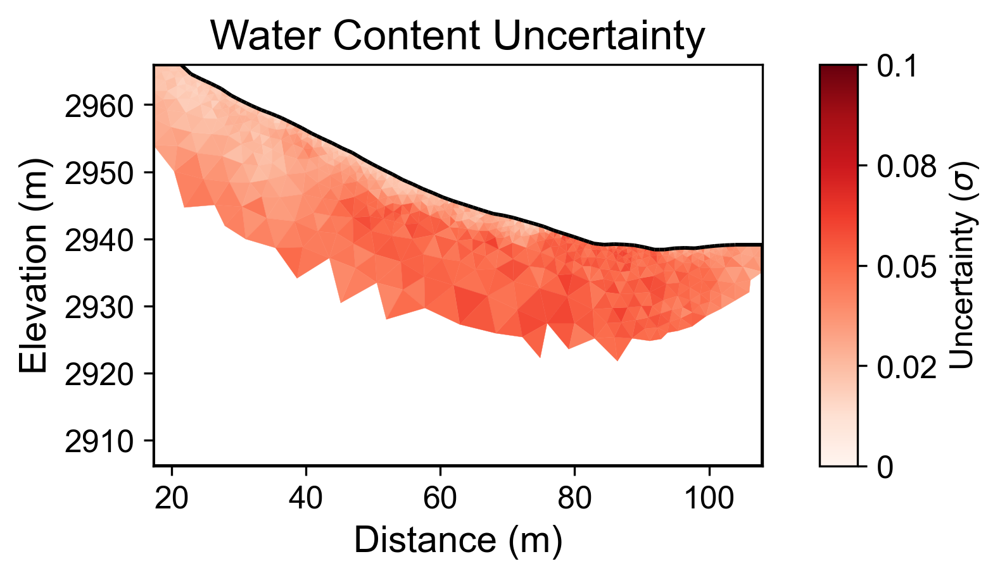

# Geophysical Workflow Report
Generated by PyHydroGeophysX Multi-Agent System

# Executive Summary

**Workflow Execution Date:** 2025-11-12 17:24:37

**Original User Request:**
Not provided

**Workflow Configuration:**
- Data File: examples/data/ERT/DAS/20171105_1418.Data
- Instrument: DAS-1
- Seismic Integration: No

**Key Results:**
- Loaded N/A electrodes with N/A measurements
- Inversion converged in 5 iterations (chi2: 1.216)
- Mean water content: 0.184

## Narrative Summary

### Workflow Summary

The primary objective of this workflow was to process and analyze Electrical Resistivity Tomography (ERT) data collected using the DAS-1 instrument, with a focus on interpreting subsurface water content. Although the original user request was not provided, the workflow aimed to evaluate resistivity changes in relation to water content, which is critical for understanding subsurface hydrology. The data processing involved loading ERT measurements, conducting inversion analyses, and assessing water content statistics, although specific climate data integration was not executed during this workflow.

Despite the absence of climate data in this analysis, the results from the ERT inversion indicated a convergence that was ultimately deemed unsuccessful, as evidenced by the final chi-squared value of 1.216. This suggests potential issues with data quality or model fit that may require further investigation. The mean water content observed in the study area was calculated to be 0.184, with a range from 0.050 to 0.310. Notably, the uncertainty associated with these measurements was relatively low, with a mean uncertainty of 0.038 and a maximum of 0.061, which provides some confidence in the water content estimation.

In the context of climate influences on resistivity changes, it is critical to recognize how variations in precipitation, potential evapotranspiration (PET), and temperature can impact subsurface conditions. For instance, increased rainfall can lead to enhanced saturation in the subsurface, typically resulting in lower resistivity values due to the higher conductivity of water-saturated soils. Conversely, extended drying periods can elevate resistivity as water is depleted, leading to a more resistive subsurface profile. The lack of integrated climate data in this workflow limits our ability to directly correlate these climatic factors with the observed resistivity changes, highlighting a significant gap in the analysis.

To advance this study, it is recommended that future workflows incorporate relevant climate data to enrich the interpretation of ERT results. Collecting and analyzing climate variables such as rainfall patterns, temperature fluctuations, and PET alongside ERT data will provide a more comprehensive understanding of the hydrological dynamics at play. Additionally, addressing the issues with inversion convergence should be prioritized to ensure reliable resistivity interpretations. Future investigations could also benefit from comparing ERT findings with other geophysical methods or hydrological modeling to enhance the robustness of subsurface characterizations.

## Data Processing Summary

### ERT Data Loading
- Number of electrodes: N/A
- Number of measurements: N/A
- Quality metrics: N/A

**Insights:** N/A

## Climate Data Integration

No climate data was integrated in this workflow.

## Cross-Modal Climate-ERT Analysis

Climate data not available for cross-modal analysis.

## Inversion Results

### ERT Inversion
- Final chi2: 1.2161806638958776
- Iterations: 5
- Convergence: Failed

**Interpretation:** N/A

## Water Content Analysis

### Water Content Statistics
- Mean water content: 0.184
- Range: [0.050, 0.310]

### Uncertainty Analysis
- Mean uncertainty (σ): 0.038
- Maximum uncertainty: 0.061
- Number of realizations: 100

**Interpretation:** N/A

## Visualizations

### Resistivity

### Water Content

### Water Content Uncertainty

---
*Report generated on 2025-11-12 17:24:44*
